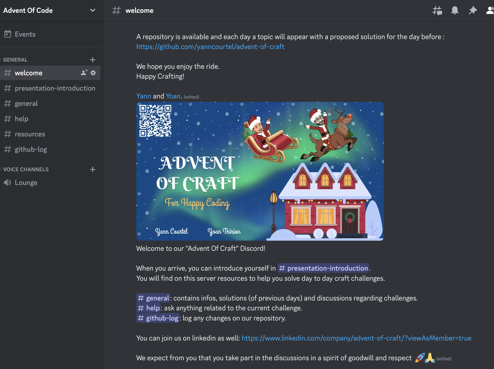

# Advent Of Craft

Christmas is here!

Your journey as a developer has probably taken many turns.

You probably had to troubleshoot and refactor a piece of code that you still have nightmares about.

You might have been stuck in a team when you never have time to improve your code base because `"We have to deliver more features"`.

Heck, you probably still are.

We feel you, and in the spirit of Christmas, you deserve a gift.

We have the privilege this year, in collaboration with Yoan, to bring to you the Advent of Craft. 
This is a journey into software craftsmanship.

Each day, `you will be taken in a small aspect of software craftsmanship`. Each day, you will have `an exercise with a topic` to look at in a small bite approach and hopefully you will `learn something`.

From refactoring to testing to reviewing, all aspects are going to be explored.

> The objective of this journey is to learn new crafts and share with your peers, not to get lost in impossible algorithm exercises or to finish as fast as you can using chatGPT.

A repository is available and each day a topic will appear with a proposed solution for the day before.

We hope you enjoy the ride. 
Happy Crafting!

## Join us on Discord
To facilitate the communication around challenges you can join us on `Discord` by simply clicking [here](https://discord.gg/E5Z9s9UKTS).

