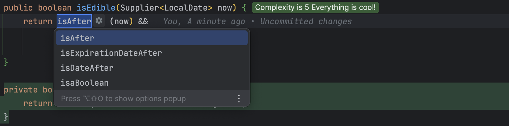

## Day 1: Make your production code easier to understand.
### Encapsulate Conditionals
If conditionals are too complex, it might hamper readability.

- Start by simplifying the code


- Then `Extract Method` for each part of the condition



- Think deeply on the business to find names that represent it

```java
public record Food(LocalDate expirationDate,
                   Boolean approvedForConsumption,
                   UUID inspectorId) {
    public boolean isEdible(Supplier<LocalDate> now) {
        return isFresh(now) &&
                canBeConsumed() &&
                hasBeenInspected();
    }

    private boolean isFresh(Supplier<LocalDate> now) {
        return this.expirationDate.isAfter(now.get());
    }

    private boolean hasBeenInspected() {
        return this.inspectorId != null;
    }

    private Boolean canBeConsumed() {
        return this.approvedForConsumption;
    }
}
```

- <u>⚠️ WARNING:</u> Make sure your tests are still passing throughout your refactoring!
