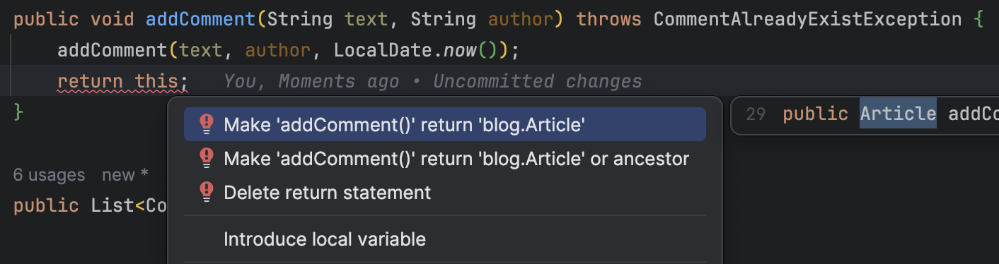
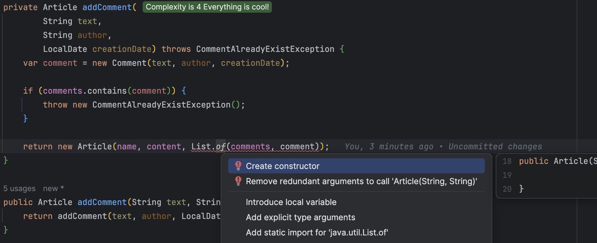

## Day 16: Make this code immutable.
- If we make the `Article` immutable that means its contract will look like this
  - `addComment`: `String` -> `String` -> `LocalDate` -> `Article`


- `Comment` is immutable by design because it is a `record`

```java
public record Comment(String text, String author, LocalDate creationDate) {
}
```

🔴 Let's describe this in a test
- We do not use the `when`, `then` DSL to adapt it later on

```java
@Test
void should_add_comment_in_an_article_immutable() throws CommentAlreadyExistException {
    var newArticle = anArticle()
            .build()
            .addComment(COMMENT_TEXT, AUTHOR);

    assertThat(newArticle.getComments()).hasSize(1);
    assertComment(newArticle.getComments().get(0), COMMENT_TEXT, AUTHOR);
}
```

- Of course, we can not compile anymore


🟢 We go to green as fast as possible
- By simply returning `this` like in a `Fluent API` (`ArticleBuilder` for example 😉)



🔵 Refactor to immutability
- We adapt the `private` method to instantiate a new `Article`
  - Based on the current one

```java
private Article addComment(
        String text,
        String author,
        LocalDate creationDate) throws CommentAlreadyExistException {
    var comment = new Comment(text, author, creationDate);

    if (comments.contains(comment)) {
        throw new CommentAlreadyExistException();
    }
    return new Article(name, content, List.of(comments, comment));
}
```

- We need to create a new constructor from here



- Natively in java, it is not that easy to use an immutable `List`...
  - The proposal above does not work
  - We can adapt the code as below...

```java
private Article addComment(
        String text,
        String author,
        LocalDate creationDate) throws CommentAlreadyExistException {
    var comment = new Comment(text, author, creationDate);

    if (comments.contains(comment)) {
        throw new CommentAlreadyExistException();
    }

    var newComments = new ArrayList<>(comments);
    // Not really immutable...
    newComments.add(comment);

    return new Article(name, content, unmodifiableList(newComments));
}
```

🔴 😱 This refactoring impacted the tests...

- We now have to adapt the tests to go back to a safe state
- We fix the test `dsl`

```java
private void when(ArticleBuilder articleBuilder, Function<Article, Article> act) throws CommentAlreadyExistException {
    article = act.apply(
            articleBuilder.build()
    );
}

private void when(Function<Article, Article> act) throws CommentAlreadyExistException {
    when(anArticle(), act);
}

private void when(Function<ArticleBuilder, ArticleBuilder> options, Function<Article, Article> act) throws Throwable {
    when(options.apply(anArticle()), act);
}

private void then(ThrowingConsumer<Article> act) {
    act.accept(article);
}
```

- The `CommentAlreadyException` is a real pain in the ass...
  - Making our test and code hardly readable...

```java
@Test
  void should_add_comment_in_an_article_containing_already_a_comment() throws Throwable {
      final var newComment = create(String.class);
      final var newAuthor = create(String.class);

      when(ArticleBuilder::commented, article -> {
          try {
              return article.addComment(newComment, newAuthor);
          } catch (CommentAlreadyExistException e) {
              throw new RuntimeException(e);
          }
      });
      then(article -> {
          assertThat(article.getComments()).hasSize(2);
          assertComment(article.getComments().getLast(), newComment, newAuthor);
      });
  }
```

- Why is it not a `RuntimeException`?
  - Let's remove the pain by doing it...

```java
public class CommentAlreadyExistException extends RuntimeException {
}
```

- Tests are still failing...


- We need to adapt our `Test Data Builder`

```java
public Article build() throws CommentAlreadyExistException {
    var article = new Article(
            "Lorem Ipsum",
            "consectetur adipiscing elit, sed do eiusmod tempor incididunt ut labore"
    );

    // Adapt the call to addComment
    for (Map.Entry<String, String> comment : comments.entrySet()) {
        article.addComment(comment.getKey(), comment.getValue());
    }
    return article;
}
```

- We use a `reducer`

```java
public Article build() {
    return comments.entrySet()
            .stream()
            .reduce(new Article(
                    create(String.class),
                    create(String.class)
            ), (a, e) -> a.addComment(e.getKey(), e.getValue()), (p, n) -> p);
}
```

- We clean the tests
  - Remove duplicated test case
  - Adapt the `DSL` to end up with

```java
class ArticleTests {
    private Article article;

    @Test
    void should_add_comment_in_an_article() {
        when(article -> article.addComment(COMMENT_TEXT, AUTHOR));
        then(article -> {
            assertThat(article.getComments()).hasSize(1);
            assertComment(article.getComments().get(0), COMMENT_TEXT, AUTHOR);
        });
    }

    @Test
    void should_add_comment_in_an_article_containing_already_a_comment() {
        final var newComment = create(String.class);
        final var newAuthor = create(String.class);

        when(ArticleBuilder::commented, article -> article.addComment(newComment, newAuthor));
        then(article -> {
            assertThat(article.getComments()).hasSize(2);
            assertComment(article.getComments().getLast(), newComment, newAuthor);
        });
    }

    private static void assertComment(Comment comment, String commentText, String author) {
        assertThat(comment.text()).isEqualTo(commentText);
        assertThat(comment.author()).isEqualTo(author);
    }

    private void when(ArticleBuilder articleBuilder, Function<Article, Article> act) throws CommentAlreadyExistException {
        article = act.apply(
                articleBuilder.build()
        );
    }

    private void when(Function<Article, Article> act) {
        when(anArticle(), act);
    }

    private void when(Function<ArticleBuilder, ArticleBuilder> options, Function<Article, Article> act) {
        when(options.apply(anArticle()), act);
    }

    private void then(ThrowingConsumer<Article> act) {
        act.accept(article);
    }

    @Nested
    class Fail {
        @Test
        void when__adding_an_existing_comment() {
            var article = anArticle()
                    .commented()
                    .build();

            assertThatThrownBy(() -> {
                article.addComment(article.getComments().get(0).text(), article.getComments().get(0).author());
            }).isInstanceOf(CommentAlreadyExistException.class);
        }
    }
}
```

### Use Immutable List
🔵 Let's refactor the internal of `Article` to use an immutable collection
- We use [`vavr`](https://docs.vavr.io/#_collections) collection to do so

```xml
<properties>
    <vavr.version>0.10.4</vavr.version>
</properties>

<dependencies>
    <dependency>
        <groupId>io.vavr</groupId>
        <artifactId>vavr</artifactId>
        <version>${vavr.version}</version>
        <scope>test</scope>
    </dependency>
</dependencies>
```

- We adapt the `Article` to end up with

```java
public class Article {
    private final String name;
    private final String content;
    // Immutable by design
    private final Seq<Comment> comments;

    public Article(String name, String content) {
        this(name, content, of());
    }

    private Article(String name, String content, Seq<Comment> comments) {
        this.name = name;
        this.content = content;
        this.comments = comments;
    }

    private Article addComment(
            String text,
            String author,
            LocalDate creationDate) throws CommentAlreadyExistException {
        var comment = new Comment(text, author, creationDate);

        if (comments.contains(comment)) {
            throw new CommentAlreadyExistException();
        }
        // any mutation creates a new instance
        return new Article(name, content, comments.append(comment));
    }

    public Article addComment(String text, String author) {
        return addComment(text, author, LocalDate.now());
    }

    public Seq<Comment> getComments() {
        return comments;
    }
}
```