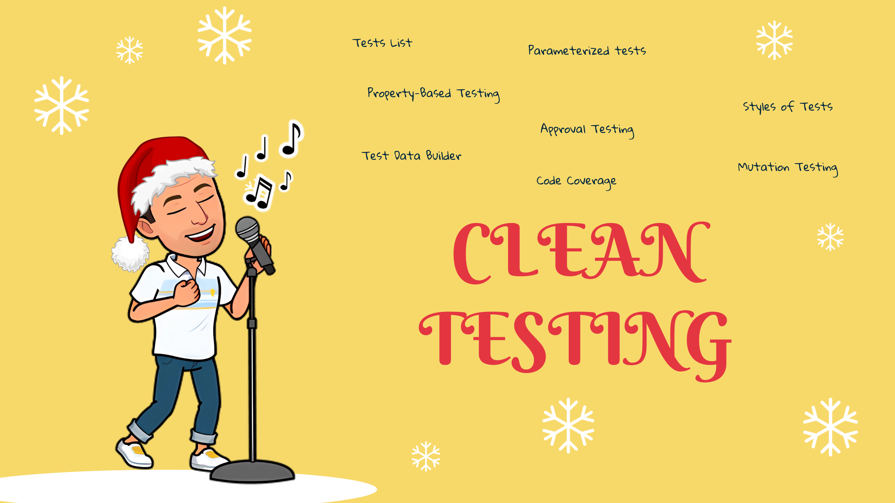

## Clean Testing 🧼

- [Day 4: Identify the behavior under test and rewrite the tests.](../exercise/day04/challenge.md)
  - Focus tests on behaviors (not data)
  - Tests List
  - Avoid duplication (Clean Code applied on tests)
- [Day 6: Parameterize your tests.](../exercise/day06/challenge.md)
  - Parameterized tests
- [Day 13: Find a way to eliminate the irrelevant, and amplify the essentials of those tests.](../exercise/day13/challenge.md)
  - Test Data Builder
  - `DSL` for our tests
- [Day 15: Put a code under tests.](../exercise/day15/challenge.md)
  - Approval testing
  - Combination testing
  - Work effectively with legacy code
- [Day 17: Design one test that has the impact of thousands.](../exercise/day17/challenge.md)
  - Property-Based Testing
  - From `Parameterized tests` to `Property-Based tests`
- [Day 21: Refactor the tests and production code to Output-Based tests.](../exercise/day21/challenge.md)
  - Styles of Tests
    - State-Based
    - Output-Based
    - Communication-Based
  - Refactor to Output-Based tests
  - Functional Core, Imperative Shell
- [Day 23: Refactor the code after putting it under test.](../exercise/day23/challenge.md)
  - Code coverage
  - Mutation Testing