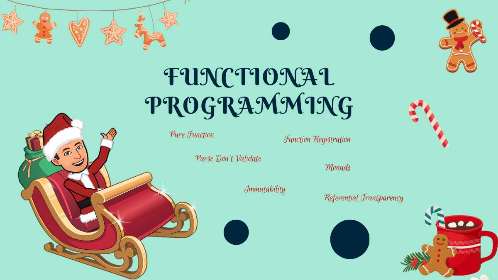

## Functional Programming 🌋

- [Day 5: No "for" loop authorized.](../exercise/day05/challenge.md)
  - Use Collection Functions
- [Day 10: Dot not use "if" statement.](../exercise/day10/challenge.md)
  - Pure Function
  - Functional Map (function registration)
  - Object Calisthenics
- [Day 14: Do not use exceptions anymore.](../exercise/day14/challenge.md)
  - Parse Don't Validate
  - Use Monads instead of Exceptions
  - Extend Output
  - Referential Transparency
- [Day 16: Make this code immutable.](../exercise/day16/challenge.md)
  - Immutability
  - Use `T.D.D` to refactor existing code
  - Strangler Pattern
- [Day 19: Loosing up dead weight.](../exercise/day19/challenge.md)
  - Exceptions vs Errors
  - Use error instead of exceptions
- [Day 23: Refactor the code after putting it under test.](../exercise/day23/challenge.md)
  - Use Monads
  - Referential Transparency