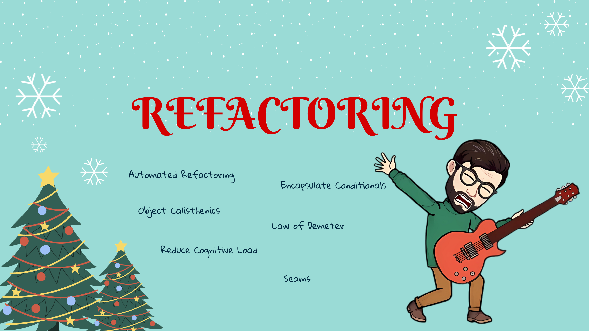

## Refactoring 🚀

- [Day 1: Make your production code easier to understand.](../exercise/day01/challenge.md)
    - Encapsulate Conditionals
    - Extract Method
    - Automated Refactoring
- [Day 2: One level of indentation.](../exercise/day02/challenge.md)
  - Object Calisthenics
  - Invert If
  - Extract Method
  - Guard
  - Automated Refactoring
- [Day 3: One dot per line.](../exercise/day03/challenge.md)
  - Object Calisthenics
  - Extract Method
  - Law of Demeter
- [Day 7: Simplify the run method by extracting the right behavior.](../exercise/day07/challenge.md)
  - Reduce cognitive load by extracting methods
  - More about cognitive load [here](https://speakerdeck.com/thirion/clean-code-du-point-de-vue-de-la-cognition)
- [Day 23: Refactor the code after putting it under test.](../exercise/day23/challenge.md)
  - Refactor Legacy Code
  - Seams
- [Day 24: Write the most complicated code you can.](../exercise/day24/challenge.md)
  - Crappy-Driven Development
  - Clean Code
