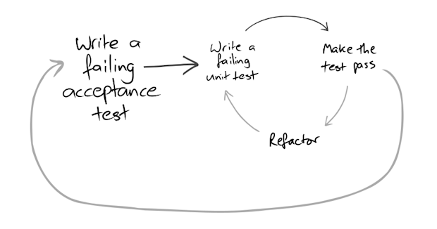

## Day 8: Your first TDD adventure.

Today your journey takes you on your first TDD adventure.
You will need to secure your ship.

The task of today is to design a password verification program. 

The password verification program will take a password as an argument and 
the password will be valid only if all these conditions are correct:

- Contains at least 8 characters
- Contains at least one capital letter
- Contains at least one lowercase letter
- Contains at least a number
- Contains at least a special character in this list `. * # @ $ % &`.
- Any other characters are not authorized.

In this program, the only thing that matters is to know if the password is valid.
Not why it is not.

Nevertheless, for the magic to work properly, you will need to follow the TDD rules. 🧙‍♂️

The TDD rules are quite simple:

    - Write production code only to pass a failing unit test.
    - Write no more of a unit test than sufficient to fail (compilation failures are failures).
    - Write no more production code than necessary to pass the one failing unit test.

A gentle reminder, the steps to use the TDD magic can be applied this way:

    🔴 Write a failing test

    🟢 Make the test pass

    🔵 Refactor your code

The magic will continue to work only with one condition:
**if at any time, your tests are not passing, you need to revert your latest change.**

The only exception to the previous rule is if you are using a double loop system. 
As shown below:

_Are you ready?_

>**Challenge of day 8: Using TDD rules, write a password validation program.**

May your crafting journey bring you new lights!

- <u>💡HINT1:</u> The project is empty, so you'll have to auto-generate your code from a test class.
- <u>💡HINT2:</u> Start with the easiest behavior to write a test for (Baby Step).
