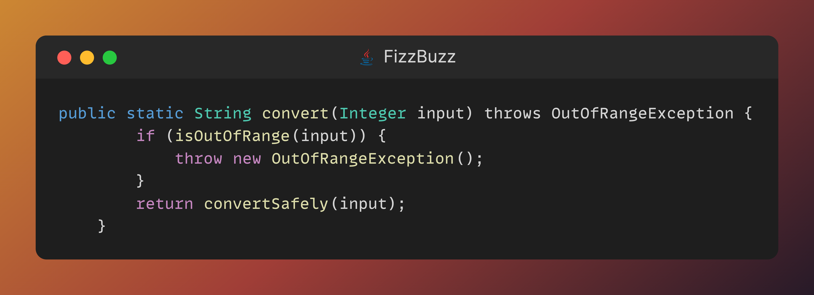

## Day 14: Throwing exceptions out the window!

Another day in your crafting journey.
Today the weather is fair and nice.

This is a perfect day for inspiration.
Today you are taking another step to higher levels.

The exercise of today seems simple, yet it is not.
You will look at this code base from the previous days.

You can read it.

You can understand it.

_But can you still improve on it?_

While refactoring this code, always remember this:
**You shall not break the tests.**

> **Challenge of day 14: Do not use exceptions anymore.**

May your crafting journey continue!

- <u>💡HINT:</u> Think of how you can return information about a faulty state.

