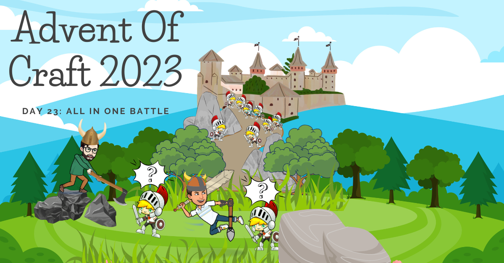

## Day 23: The last battle.

Today, the ship protection held and you are back to your homeland.

Only to see your castle occupied, your land dotted with an army.
The legacy code army!

You are by yourself and your crew, and you will need to fight
with all that you've learned and put up an appropriate defense.

Today's exercise is the all-in-one challenge.

You have to use all your crafts to refactor the code.

Some rules:
- Your production code cannot be refactored unless it's 100% tested.
- The production code may only be touched with automated IDE action.
- You may test if your tests are consistent with mutation testing.

> **Challenge of day 23: Refactor the code after putting it under test.**

- <u>💡HINT:</u> Work with the smallest scenario to test.

