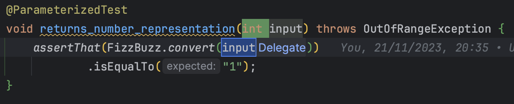

## Day 6: Parameterize your tests.

`Parameterized tests` can save us a lot of time. Know more about this concept in java [here](https://www.baeldung.com/parameterized-tests-junit-5).

- We start by adding the dependency on `junit-jupiter-params` 
  - Not really needed here because we already have the dependency `junit-jupiter` in our parent `pom.xml` file

```xml
<dependency>
    <groupId>org.junit.jupiter</groupId>
    <artifactId>junit-jupiter-params</artifactId>
    <version>${junit.version}</version>
    <scope>test</scope>
</dependency>
```

- We adapt the first test
  - By extracting parameters



- Then, we define a method source


- We set the values for this test

```java
public static Stream<Arguments> validInputs() {
    return Stream.of(
            Arguments.of(1, "1")
    );
}
```

- The test is green...

> Don't Trust Tests. Unless you have seen they fail first.

- Let's make it fail for a good reason to be sure we can trust it
  - We change the `expectedResult` for that


- We are pretty confident, so let's move other tests in `validInputs`

```java
public static Stream<Arguments> validInputs() {
    return Stream.of(
            Arguments.of(1, "1"),
            Arguments.of(67, "67"),
            Arguments.of(82, "82"),
            Arguments.of(3, "Fizz"),
            Arguments.of(66, "Fizz"),
            Arguments.of(99, "Fizz"),
            Arguments.of(5, "Buzz"),
            Arguments.of(50, "Buzz"),
            Arguments.of(85, "Buzz"),
            Arguments.of(15, "FizzBuzz"),
            Arguments.of(30, "FizzBuzz"),
            Arguments.of(45, "FizzBuzz")
    );
}

@ParameterizedTest
@MethodSource("validInputs")
void returns_number_representation(int input, String expectedResult) throws OutOfRangeException {
    assertThat(FizzBuzz.convert(input))
            .isEqualTo(expectedResult);
}
```

- With `Parameterized Tests` it could be tempting to write this kind of test
  - Here, add edge cases inside the test...

```java
public static Stream<Arguments> validInputs() {
    return Stream.of(
            Arguments.of(1, "1"),
            Arguments.of(67, "67"),
            Arguments.of(82, "82"),
            Arguments.of(3, "Fizz"),
            Arguments.of(66, "Fizz"),
            Arguments.of(99, "Fizz"),
            Arguments.of(5, "Buzz"),
            Arguments.of(50, "Buzz"),
            Arguments.of(85, "Buzz"),
            Arguments.of(15, "FizzBuzz"),
            Arguments.of(30, "FizzBuzz"),
            Arguments.of(45, "FizzBuzz"),
            Arguments.of(0, null)
    );
}

@ParameterizedTest
@MethodSource("validInputs")
void returns_number_representation(int input, String expectedResult) throws OutOfRangeException {
    if (expectedResult != null) {
        assertThat(FizzBuzz.convert(input))
                .isEqualTo(expectedResult);
    } else {
        assertThatThrownBy(() -> FizzBuzz.convert(input))
                .isInstanceOf(OutOfRangeException.class);
    }
}
```

- One advice for you, try to avoid to take decisions in your tests
  - Decisions mean you have different test cases...
  - Have dedicated test methods for specific test cases

```java
public static Stream<Arguments> validInputs() {
    return Stream.of(
            Arguments.of(1, "1"),
            Arguments.of(67, "67"),
            Arguments.of(82, "82"),
            Arguments.of(3, "Fizz"),
            Arguments.of(66, "Fizz"),
            Arguments.of(99, "Fizz"),
            Arguments.of(5, "Buzz"),
            Arguments.of(50, "Buzz"),
            Arguments.of(85, "Buzz"),
            Arguments.of(15, "FizzBuzz"),
            Arguments.of(30, "FizzBuzz"),
            Arguments.of(45, "FizzBuzz")
    );
}

public static Stream<Arguments> invalidInputs() {
    return Stream.of(
            Arguments.of(0),
            Arguments.of(-1),
            Arguments.of(101)
    );
}

@ParameterizedTest
@MethodSource("validInputs")
void returns_number_representation(int input, String expectedResult) throws OutOfRangeException {
    assertThat(FizzBuzz.convert(input))
            .isEqualTo(expectedResult);
}

@ParameterizedTest
@MethodSource("invalidInputs")
void throws_an_exception_for_numbers_out_of_range(int input) {
    assertThatThrownBy(() -> FizzBuzz.convert(input))
            .isInstanceOf(OutOfRangeException.class);
}
```
