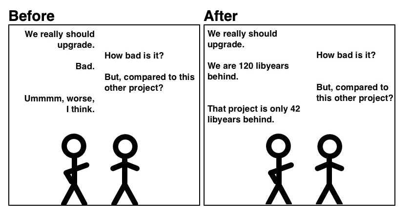

## Day 11: Gather a dependency freshness metric.
You may need to calculate this kind of metrics to ensure you are not too much in debt regarding your dependencies.

The concept of [`libyear`](https://libyear.com/) can help us to do so. 


- Let's add [`libyear-maven-plugin`](https://github.com/mfoo/libyear-maven-plugin) to our `pom.xml`

```xml
<build>
  <plugins>
    <plugin>
      <groupId>io.github.mfoo</groupId>
      <artifactId>libyear-maven-plugin</artifactId>
      <version>1.0.0</version>
      <executions>
        <execution>
          <id>libyear-analysis</id>
          <goals>
            <goal>analyze</goal>
          </goals>
        </execution>
      </executions>
    </plugin>
  </plugins>
</build>
```

- Then we run the plugin
    - It calculates the `libyears` for each dependencies
    - Meaning we have 9 libyears here...


> We should definitely do something about it...

This kind of tool can really help teams take decisions regarding dependencies debt. Metrics reassure people.


- A very interesting stuff with this plugin is its configuration


- We can make a build failing based on a given `threshold`

```xml
<configuration>
    <maxLibYears>1</maxLibYears>
</configuration>
```

- This kind of tool helps us, as a team, to take care of our dependencies
  - Forcing us to update them very regularly
  - It makes dependencies management much, much easier


If you want to know more on "how to keep you dependencies up-to-date", you read this [article](https://xtrem-tdd.netlify.app/Flavours/keep-dependencies-up-to-date).
