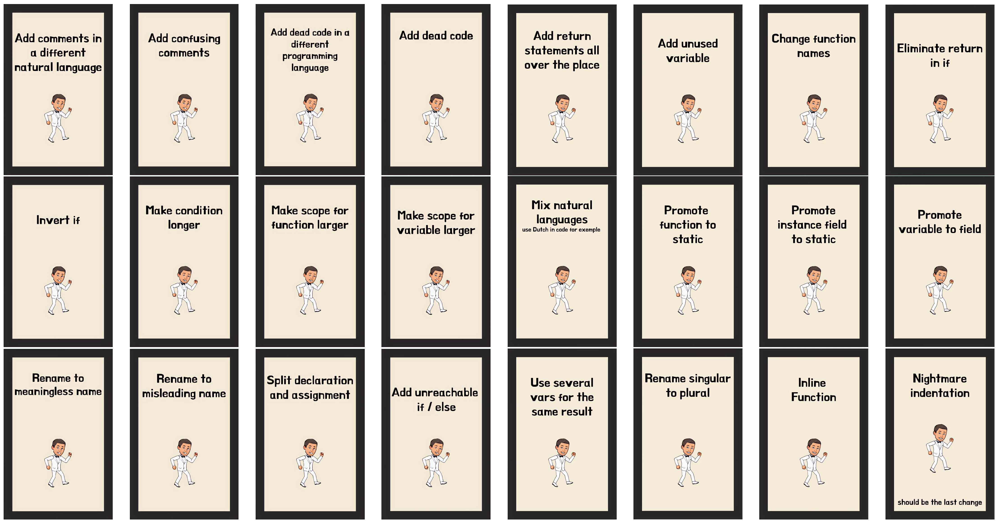

## Day 24: Write the most complicated code you can.
Let's learn a new development practice : [`Crappy-Driven Development`](https://github.com/ythirion/crappy-driven-development). 

`The secret art of making yourself indispensable by writing crappy code!!!`

- Our objective : Apply CDD to make the code so crappy that other people won't be able to understand it 
  - Follow the golden rules described below


### Let's apply it on `dive`
Here are some crappy ideas if necessary 😉

[](https://github.com/ythirion/crappy-driven-development#source-of-inspiration)

- All the code in 1 file

```java
public class Submarine {
    private final Position position;

    private Submarine(Position position) {
        this.position = position;
    }

    public Submarine(int horizontal, int depth) {
        this(new Position(horizontal, depth));
    }

    public Submarine move(List<Instruction> instructions) {
        return instructions
                .stream()
                .reduce(this, Submarine::move, (p, n) -> p);
    }

    private Submarine move(Instruction instruction) {
        return new Submarine(switch (instruction.text()) {
            case "down" -> position.changeDepth(position.depth() + instruction.x());
            case "up" -> position.changeDepth(position.depth() - instruction.x());
            default -> position.moveHorizontally(position.horizontal() + instruction.x());
        });
    }

    public Position getPosition() {
        return position;
    }

    public record Position(int horizontal, int depth) {
        public Position changeDepth(int newDepth) {
            return new Position(horizontal, newDepth);
        }

        public Position moveHorizontally(int newHorizontal) {
            return new Position(newHorizontal, depth);
        }
    }

    public record Instruction(String text, int x) {
        public static Instruction fromText(String text) {
            var split = text.split(" ");
            return new Instruction(split[0], Integer.parseInt(split[1]));
        }
    }
}
```

- Rename package and class names

```java
package M;

import java.util.List;

public class K991_P {
  ...
}
```

- `Minify` names


```java
public class K991_P {
    private final B b;

    private K991_P(B b) {
        this.b = b;
    }

    public K991_P(int c, int d) {
        this(new B(c, d));
    }

    public K991_P v(List<A> instructions) {
        return instructions
                .stream()
                .reduce(this, K991_P::v, (p, n) -> p);
    }

    private K991_P v(A x) {
        return new K991_P(switch (x.text()) {
            case "down" -> b.e1(b.b() + x.x());
            case "up" -> b.e1(b.b() - x.x());
            default -> b.e2(b.a() + x.x());
        });
    }

    public B getB() {
        return b;
    }

    public record B(int a, int b) {
        public B e1(int nd) {
            return new B(a, nd);
        }

        public B e2(int nd) {
            return new B(nd, b);
        }
    }

    public record A(String text, int x) {
        public static A f(String t) {
            var split = t.split(" ");
            return new A(split[0], Integer.parseInt(split[1]));
        }
    }
}
```

- Add `unused variables` and `useless code`

```java
private K991_P v(A x) {
    var jd = 89;
    var i = 8;
    var jk = Math.pow(jd, 99);

    var p = range(-199, jd)
            .mapToDouble(k -> jk / k)
            .reduce(i, Double::sum);

    return new K991_P(switch (x.text()) {
        case "down" -> b.e1(b.b() + x.x());
        case "up" -> b.e1(b.b() - x.x());
        default -> b.e2(b.a() + x.x());
    });
}
```

- Add `commented code` in another programming language
  - In [`brainfuck`](https://en.wikipedia.org/wiki/Brainfuck#:~:text=Brainfuck%20is%20an%20esoteric%20programming%20language%20created%20in%201993%20by%20Urban%20M%C3%BCller.&text=Notable%20for%20its%20extreme%20minimalism,pointer%20and%20an%20instruction%20pointer.) here
```java
/*
    >+++++[>+++++++<-]>.<<++[>+++++[>+++++++<-]<-]>>.+++++.<++[>-----<-]>-.<++
    [>++++<-]>+.<++[>++++<-]>+.[>+>+>+<<<-]>>>[<<<+>>>-]<<<<<++[>+++[>---<-]<-
    ]>>+.+.<+++++++[>----------<-]>+.<++++[>+++++++<-]>.>.-------.-----.<<++[>
    >+++++<<-]>>.+.----------------.<<++[>-------<-]>.>++++.<<++[>++++++++<-]>
    .<++++++++++[>>>-----------<<<-]>>>+++.<-----.+++++.-------.<<++[>>+++++++
    +<<-]>>+.<<+++[>----------<-]>.<++[>>--------<<-]>>-.------.<<++[>++++++++
    <-]>+++.---....>++.<----.--.<++[>>+++++++++<<-]>>+.<<++[>+++++++++<-]>+.<+
    +[>>-------<<-]>>-.<--.>>.<<<+++[>>++++<<-]>>.<<+++[>>----<<-]>>.++++++++.
    +++++.<<++[>---------<-]>-.+.>>.<<<++[>>+++++++<<-]>>-.>.>>>[-]>>[-]<+[<<[
    -],[>>>>>>>>>>>>>+>+<<<<<<<<<<<<<<-]>>>>>>>>>>>>>>[<<<<<<<<<<<<<<+>>>>>>>>
    >>>>>>-]<<+>[-[-[-[-[-[-[-[-[-[-[-[-[-[-[-[-[-[-[-[-[-[-[-[-[-[-[-[-[-[-[-
    [-[-[-[-[-[-[-[-[-[-[-[<->[-]]]]]]]]]]]]]]]]]]]]]]]]]]]]]]]]]]]]]]]]]]]]<[
    <<<<<<<<<<<<[-]>>>>>>>>>>>>[-]]<<<<<<<<<<<<[<+++++[>---------<-]>++[>]>>[>
    +++.
*/
```

- Use `misleading` names

```java
private K991_P toString(A x) {
    var jd = 89;
    var i = 8;
    var jk = Math.pow(jd, 99);

    var p = range(-199, jd)
            .mapToDouble(k -> jk / k)
            .reduce(i, Double::sum);

    return new K991_P(switch (x.q()) {
        case "down" -> b.e1(b.b() + x.x());
        case "up" -> b.e1(b.b() - x.x());
        default -> b.e2(b.a() + x.x());
    });
}
```

- Add brainfuck `comment`

```java
/**
 * All the x must be binary equals to the ^
 * It's not easy to code like this 😱
 * “A question that sometimes drives me hazy: am I or are the others crazy?” - Albert Einstein
 *
 * @param x
 */
```

- Change pattern matching to `if else`

```java
B b1;
if (x.q().equals("down")) {
    b1 = b.e1(b.b() + x.x());
} else if (x.q().equals("up")) {
    b1 = b.e1(b.b() - x.x());
} else {
    b1 = b.e2(b.a() + x.x());
}
```

> We highly increased the complexity 🤩


- `Encrypt` business strings
  - Use `hashCode()` to do so

```java
B b1;
if (x.q().hashCode() == 3_089_570) {
    b1 = b.e1(b.b() + x.x());
} else if (x.q().hashCode() == 3_739) {
    b1 = b.e1(b.b() - x.x());
} else {
    b1 = b.e2(b.a() + x.x());
}
return new K991_P(b1);
```

- `Kill` the formatter 😜
  - Here is the final result

```java
public class K991_P {
    private static final double M_UNIVERSE = 0.9;
    private final B b;
    private K991_P(B b) {
        this.b = b;
    }public K991_P(int c, int d) {
        this(new B(c, d));
    }

    public K991_P toString(List<A> persons) {
        return persons.stream().reduce(this, K991_P::toString, (p, n) -> p);
    }

    /**
     * All the x must be binary equals to the ^
     * It's not easy to code like this 😱
     * “A question that sometimes drives me hazy: am I or are the others crazy?” - Albert Einstein
     *
     * @param x
     */
    private K991_P toString(A x) {
        var jd = 89;var i = 8;var jk = Math.pow(jd, 99); var p = range(-199, jd)
                .mapToDouble(k -> jk / k)
                .reduce(i, Double::sum);
        if (p * 1_000 < M_UNIVERSE) {return new K991_P(new B(42, 42));}

        B b1; if (x.q().hashCode() == 3_089_570) {b1 = b.e1(b.b() + x.x());} else if (x.q()
                .hashCode() == 3_739) {b1 = b.e1(b.b() - x.x()
        );} else {b1 = b.e2(b.a() + x.x());} return new K991_P(b1);
    }

    public B getB() {return b;}

    public record B(int a, int b) { public B e1(int nd) {return new B(a, nd);} public B e2(int nd) {return new B(nd, b);}}

    /*
        >+++++[>+++++++<-]>.<<++[>+++++[>+++++++<-]<-]>>.+++++.<++[>-----<-]>-.<++
        [>++++<-]>+.<++[>++++<-]>+.[>+>+>+<<<-]>>>[<<<+>>>-]<<<<<++[>+++[>---<-]<-
        ]>>+.+.<+++++++[>----------<-]>+.<++++[>+++++++<-]>.>.-------.-----.<<++[>
        >+++++<<-]>>.+.----------------.<<++[>-------<-]>.>++++.<<++[>++++++++<-]>
        .<++++++++++[>>>-----------<<<-]>>>+++.<-----.+++++.-------.<<++[>>+++++++
        +<<-]>>+.<<+++[>----------<-]>.<++[>>--------<<-]>>-.------.<<++[>++++++++
        <-]>+++.---....>++.<----.--.<++[>>+++++++++<<-]>>+.<<++[>+++++++++<-]>+.<+
        +[>>-------<<-]>>-.<--.>>.<<<+++[>>++++<<-]>>.<<+++[>>----<<-]>>.++++++++.
        +++++.<<++[>---------<-]>-.+.>>.<<<++[>>+++++++<<-]>>-.>.>>>[-]>>[-]<+[<<[
        -],[>>>>>>>>>>>>>+>+<<<<<<<<<<<<<<-]>>>>>>>>>>>>>>[<<<<<<<<<<<<<<+>>>>>>>>
        >>>>>>-]<<+>[-[-[-[-[-[-[-[-[-[-[-[-[-[-[-[-[-[-[-[-[-[-[-[-[-[-[-[-[-[-[-
        [-[-[-[-[-[-[-[-[-[-[-[<->[-]]]]]]]]]]]]]]]]]]]]]]]]]]]]]]]]]]]]]]]]]]]]<[
        <<<<<<<<<<<<[-]>>>>>>>>>>>>[-]]<<<<<<<<<<<<[<+++++[>---------<-]>++[>]>>[>
        +++.
    */

    public record A(String q, int x) {
        public static A f(String t) {var split = t.split(" ");return new A(split[0], Integer.parseInt(split[1]));}
    }
}
```