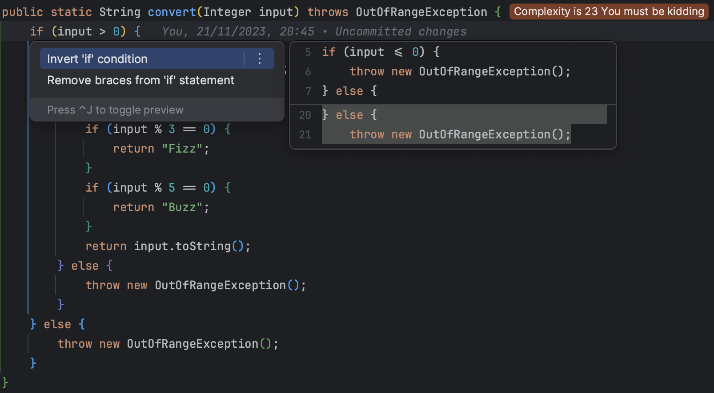

## [Day 2: Your code can only have one level of indentation.](https://williamdurand.fr/2013/06/03/object-calisthenics/#1-only-one-level-of-indentation-per-method)
- Start by inverting condition


- Apply the same `safe` refactoring for the other `if` on input


- Our code now looks like :

```java
public static String convert(Integer input) throws OutOfRangeException {
    if (input <= 0) {
        throw new OutOfRangeException();
    }
    if (input > 100) {
        throw new OutOfRangeException();
    } else {
        if (input % 3 == 0 && input % 5 == 0) {
            return "FizzBuzz";
        }
        if (input % 3 == 0) {
            return "Fizz";
        }
        if (input % 5 == 0) {
            return "Buzz";
        }
        return input.toString();
    }
}
```

- We can remove the redundant else


- We group the guard in the same condition

```java
public static String convert(Integer input) throws OutOfRangeException {
    if (input <= 0 || input > 100) {
        throw new OutOfRangeException();
    }
    if (input % 3 == 0 && input % 5 == 0) {
        return "FizzBuzz";
    }
    if (input % 3 == 0) {
        return "Fizz";
    }
    if (input % 5 == 0) {
        return "Buzz";
    }
    return input.toString();
}
```

Congrats, we now have only one level of indentation.
We still have space for improvement...

```java
public static String convert(Integer input) throws OutOfRangeException {
    // Encapsulate the condition
    if (input <= 0 || input > 100) {
        throw new OutOfRangeException();
    }
    // Avoid magic numbers
    if (input % 3 == 0 && input % 5 == 0) {
        return "FizzBuzz";
    }
    // Modulo repeated everywhere
    if (input % 3 == 0) {
        return "Fizz";
    }
    if (input % 5 == 0) {
        return "Buzz";
    }
    return input.toString();
}
```

- Here is an "improved" version of it

```java
public class FizzBuzz {
    public static final int MIN = 0;
    public static final int MAX = 100;
    public static final int FIZZ = 3;
    public static final int BUZZ = 5;
    public static final int FIZZBUZZ = 15;

    private FizzBuzz() {
    }

    public static String convert(Integer input) throws OutOfRangeException {
        if (isOutOfRange(input)) {
            throw new OutOfRangeException();
        }
        return convertSafely(input);
    }

    private static String convertSafely(Integer input) {
        if (is(FIZZBUZZ, input)) {
            return "FizzBuzz";
        }
        if (is(FIZZ, input)) {
            return "Fizz";
        }
        if (is(BUZZ, input)) {
            return "Buzz";
        }
        return input.toString();
    }

    private static boolean is(Integer divisor, Integer input) {
        return input % divisor == 0;
    }

    private static boolean isOutOfRange(Integer input) {
        return input <= MIN || input > MAX;
    }
}
```
