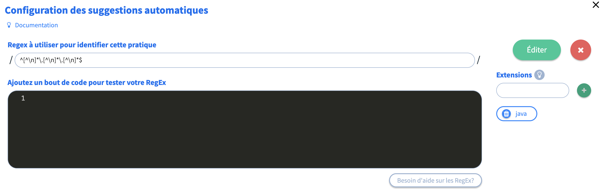
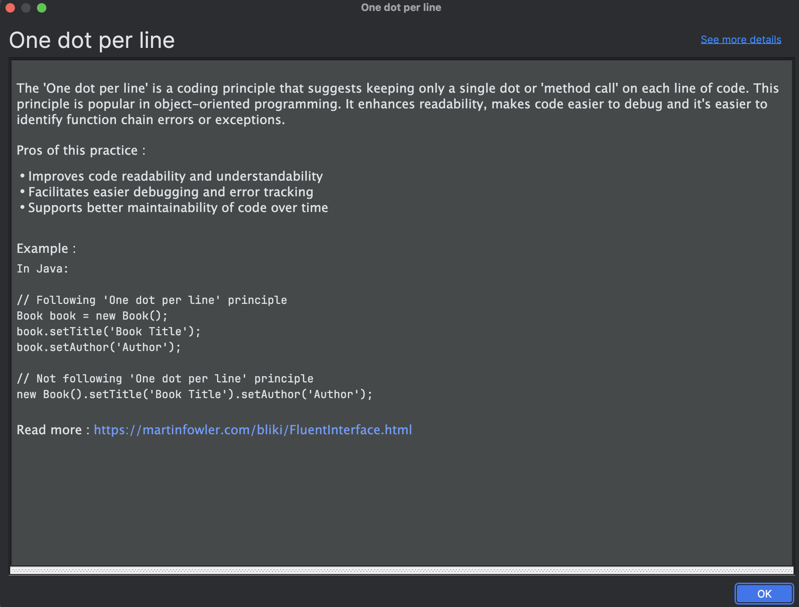
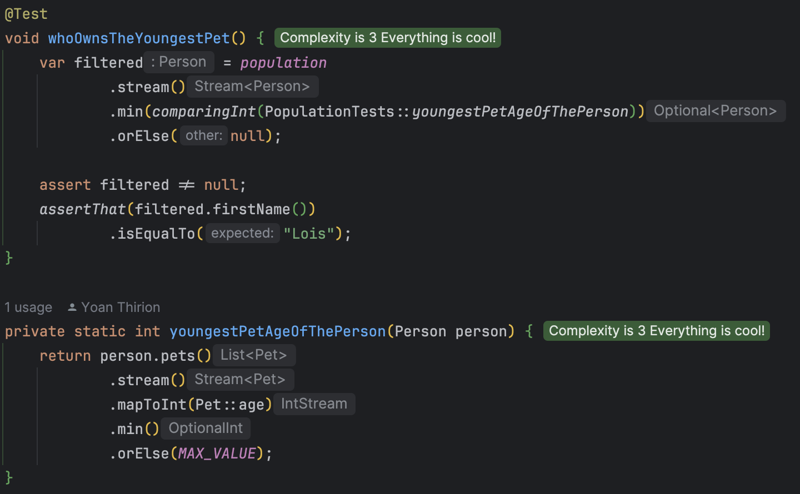

## Day 3: One dot per line.
As a human being, how could it be possible to understand this code? We read vertically and here everything is positioned horizontally...

```java
@Test
void whoOwnsTheYoungestPet() {
    var filtered = population.stream().min(Comparator.comparingInt(person -> person.pets().stream().mapToInt(Pet::age).min().orElse(Integer.MAX_VALUE))).orElse(null);

    assert filtered != null;
    assertThat(filtered.firstName()).isEqualTo("Lois");
}
```

We want to enforce the `1 dot per line rule` because:
- High cognitive load to understand the code
- No IDE support
- Hard to understand what is changed from our git log

Let's start by improving the code by simply add some return lines
- It is already simpler to understand...


- Now our IDE is able to provide us some help by displaying return types on lines


- How could we go further?
  - We still have several dot per lines
  - Let's use `Extract Method`


- Our code now looks like this

```java
@Test
void whoOwnsTheYoungestPet() {
    var filtered = population.stream()
            .min(comparingInt(PopulationTests::youngestPetAgeOfThePerson))
            .orElse(null);

    assert filtered != null;
    assertThat(filtered.firstName()).isEqualTo("Lois");
}

private static int youngestPetAgeOfThePerson(Person person) {
    return person.pets()
            .stream()
            .mapToInt(Pet::age)
            .min()
            .orElse(Integer.MAX_VALUE);
}
```

- We could go further by putting the behaviors closer to the business logic to respect the [law of Demeter](https://medium.com/vattenfall-tech/the-law-of-demeter-by-example-fd7adbf0c324) 
  - Moving the `youngestPetAgeOfThePerson` method in `Person` for example

### Vavr alternative
By using, alternative `collections` the code could be a little bit less verbose...

Take a look at it :

```java
@Test
void whoOwnsTheYoungestPet() {
    assertThat(population
            .minBy(PopulationWithVavrTests::youngestPetAgeOfThePerson)
            .get()
            .firstName()
    ).isEqualTo("Lois");
}

private static int youngestPetAgeOfThePerson(Person p) {
    // List.ofAll(p.pets()) is needed here, just to convert java list to vavr list
    return List.ofAll(p.pets())
            .map(Pet::age)
            .min()
            .getOrElse(MAX_VALUE);
}
```

### [Promyze](https://www.promyze.com/)
Promyze is a platform with the below promise:
> Help you build always up-to-date coding standards that your team can learn from, making them actionnable in the IDE and during PRs.

As a team, we may define this kind of rules and use `Promyze` to detect this guideline during coding.

- In the platform we can define the `Practice`


- Configure the tool to detect in real time during coding (with `regex`)



Here is the regex used `^[^\n]*\.[^\n]*\.[^\n]*$`.

- Once done, the suggestions appear (a rocket on the line)


- In our IDE, we can see the details directly



- The suggestions do not appear after our refactoring 🤩

