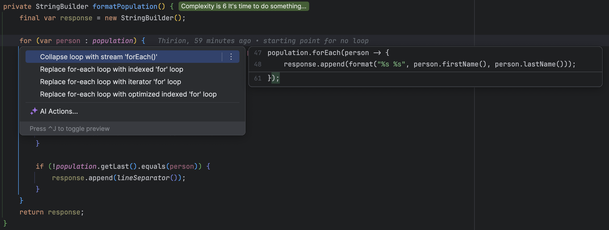
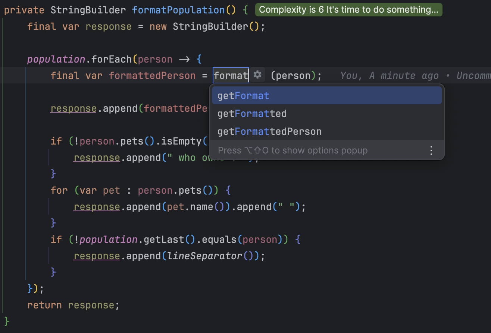

## Day 5: No "for" loop authorized.

Instead of for loops we can use functions on `List`

- Let's leverage the power of our IDE


- Our code now looks like this

```java
private StringBuilder formatPopulation() {
    final var response = new StringBuilder();

    population.forEach(person -> {
        response.append(format("%s %s", person.firstName(), person.lastName()));
        if (!person.pets().isEmpty()) {
            response.append(" who owns : ");
        }
        for (var pet : person.pets()) {
            response.append(pet.name()).append(" ");
        }
        if (!population.getLast().equals(person)) {
            response.append(lineSeparator());
        }
    });
    return response;
}
```

Ok we do not have a `for` loop anymore, may we go further?

- Let's do it 🚀
    - One way to do it is to not use a `StringBuilder` anymore but aggregating the `String`
    - We prepare our refactoring by extracting variables


- Then, we extract method



- Then we move pet logic inside the new method
  - We make the logic independent of the `StringBuilder` (`Pure Function`)

```java
private StringBuilder formatPopulation() {
    final var response = new StringBuilder();

    population.forEach(person -> {
        final var formattedPerson = formatPerson(person);
        response.append(formattedPerson);

        if (!population.getLast().equals(person)) {
            response.append(lineSeparator());
        }
    });
    return response;
}

private static String formatPerson(Person person) {
    StringBuilder formattedPerson = new StringBuilder(format("%s %s", person.firstName(), person.lastName()));

    if (!person.pets().isEmpty()) {
        formattedPerson.append(" who owns : ");
        for (var pet : person.pets()) {
            formattedPerson.append(pet.name()).append(" ");
        }
    }
    return formattedPerson.toString();
}
```

- We can now replace the `forEach` by the `map` method (`Person` -> `String`)
  - Regarding the `lineSeparator()` logic we can use a collector

```java
private String formatPopulation() {
    return population.stream()
            .map(PopulationTests::formatPerson)
            .collect(Collectors.joining(lineSeparator()));
}
```

- We can simplify the `formatPerson` method as well

```java
private static String formatPerson(Person person) {
    return format("%s %s", person.firstName(), person.lastName()) +
            (!person.pets().isEmpty() ? formatPets(person) : "");
}

private static String formatPets(Person person) {
    return person.pets()
            .stream()
            .map(Pet::name)
            .collect(Collectors.joining(" ", " who owns : ", " "));
}
```

- Our final version of the code looks like this :

```java
private String formatPopulation() {
    return population.stream()
            .map(PopulationTests::formatPerson)
            .collect(Collectors.joining(lineSeparator()));
}

private static String formatPerson(Person person) {
    return format("%s %s", person.firstName(), person.lastName()) +
            (!person.pets().isEmpty() ? formatPets(person) : "");
}

private static String formatPets(Person person) {
    return person.pets()
            .stream()
            .map(Pet::name)
            .collect(Collectors.joining(" ", " who owns : ", " "));
}
```

### Vavr alternative
By using, alternative `collections` the code could be a little bit less verbose...

Take a look at it :

```java
private static String formatPopulation() {
    return population
            .map(PopulationWithVavrTests::formatPerson)
            .mkString(lineSeparator());
}

private static String formatPerson(Person person) {
    return format("%s %s", person.firstName(), person.lastName()) +
            (!person.pets().isEmpty() ? formatPets(person) : "");
}

private static String formatPets(Person person) {
    return List.ofAll(person.pets())
            .map(Pet::name)
            .mkString(" who owns : ", " ", " ");
}
```
