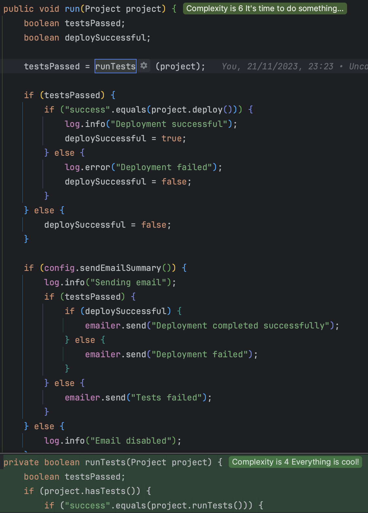

## Day 7: Simplify the run method by extracting the right behavior.

Here we will use `Extract Method` refactorings to make our code more readable / maintainable.

- Let's start by extracting some methods (automatically)



- Our run method now looks like this

```java
public void run(Project project) {
    boolean testsPassed;
    boolean deploySuccessful;

    testsPassed = runTests(project);
    deploySuccessful = deployProject(project, testsPassed);

    sendEmail(testsPassed, deploySuccessful);
}
```

> By just splitting the code, it is now much easier to understand the purpose of this run method

- Let's go further by refactoring the underlying methods
    - We start with the `runTests` method


- Then we change the return statements to simplify the flow
    - We remove redundant `else` as well


- At the end, this method looks like this

```java
private boolean haveTestsRanSuccessfully(Project project) {
    if (!project.hasTests()) {
        log.info("No tests");
        return true;
    }
    if (!SUCCESS.equals(project.runTests())) {
        log.error("Tests failed");
        return false;
    }
    log.info("Tests passed");
    return true;
}
```

- We apply the same technique on the deployment method

```java
private boolean hasDeployedSuccessfully(Project project, boolean testsPassed) {
    if (!testsPassed) {
        return false;
    }
    if (SUCCESS.equals(project.deploy())) {
        log.info("Deployment successful");
        return true;
    }
    log.error("Deployment failed");
    return false;
}
```

- Regarding the sending email logic let's adapt it
    - We extract the sending logic in a new method

```java
private void sendEmail(String text) {
    if (!config.sendEmailSummary()) {
        log.info("Email disabled");
        return;
    }
    log.info("Sending email");
    emailer.send(text);
}
```

- We then adapt the `run` logic

```java
public void run(Project project) {
    if (!haveTestsRanSuccessfully(project)) {
        sendEmail("Tests failed");
        return;
    }
    if (!hasDeployedSuccessfully(project)) {
        sendEmail("Deployment failed");
        return;
    }
    sendEmail("Deployment completed successfully");
}
```

- Maybe, we should invert the name of the methods to avoid the negation (`!`) and adapt them

> here is the result of our "improvements"

```java
public void run(Project project) {
    if (haveTestsFailed(project)) {
        sendEmail("Tests failed");
        return;
    }
    if (hasDeploymentFailed(project)) {
        sendEmail("Deployment failed");
        return;
    }
    sendEmail("Deployment completed successfully");
}

private boolean haveTestsFailed(Project project) {
    if (!project.hasTests()) {
        log.info("No tests");
        return false;
    }
    if (!SUCCESS.equals(project.runTests())) {
        log.error("Tests failed");
        return true;
    }
    log.info("Tests passed");
    return false;
}

private boolean hasDeploymentFailed(Project project) {
    if (SUCCESS.equals(project.deploy())) {
        log.info("Deployment successful");
        return false;
    }
    log.error("Deployment failed");
    return true;
}

private void sendEmail(String text) {
    if (!config.sendEmailSummary()) {
        log.info("Email disabled");
        return;
    }
    log.info("Sending email");
    emailer.send(text);
}
```

## Refactor the tests (bonus)

As a bonus you may have put some efforts to refactor the tests:

- Extract a `project` method to
    - centralize building logic of a `Project`
    - configure the `Email` mock
- Extract an `assertLog` method to
    - have the log assertion centralized
    - we used `assertJ` as well here

```java
class PipelineTest {
    private final Config config = mock(Config.class);
    private final CapturingLogger log = new CapturingLogger();
    private final Emailer emailer = mock(Emailer.class);

    private Pipeline pipeline;

    @BeforeEach
    void setUp() {
        pipeline = new Pipeline(config, emailer, log);
    }

    @Test
    void project_with_tests_that_deploys_successfully_with_email_notification() {
        pipeline.run(project(p -> p.setTestStatus(PASSING_TESTS)
                .setDeploysSuccessfully(true), true));

        assertLog("INFO: Tests passed",
                "INFO: Deployment successful",
                "INFO: Sending email");

        verify(emailer).send("Deployment completed successfully");
    }

    @Test
    void project_with_tests_that_deploys_successfully_without_email_notification() {
        pipeline.run(project(p -> p.setTestStatus(PASSING_TESTS)
                .setDeploysSuccessfully(true), false));

        assertLog("INFO: Tests passed",
                "INFO: Deployment successful",
                "INFO: Email disabled");

        verify(emailer, never()).send(any());
    }

    @Test
    void project_without_tests_that_deploys_successfully_with_email_notification() {
        pipeline.run(project(p -> p.setTestStatus(NO_TESTS)
                .setDeploysSuccessfully(true), true));

        assertLog("INFO: No tests",
                "INFO: Deployment successful",
                "INFO: Sending email");

        verify(emailer).send("Deployment completed successfully");
    }

    @Test
    void project_without_tests_that_deploys_successfully_without_email_notification() {
        pipeline.run(project(p -> p.setTestStatus(NO_TESTS)
                .setDeploysSuccessfully(true), false));

        assertLog("INFO: No tests",
                "INFO: Deployment successful",
                "INFO: Email disabled");

        verify(emailer, never()).send(any());
    }

    @Test
    void project_with_tests_that_fail_with_email_notification() {
        pipeline.run(project(p -> p.setTestStatus(FAILING_TESTS), true));

        assertLog("ERROR: Tests failed",
                "INFO: Sending email");

        verify(emailer).send("Tests failed");
    }

    @Test
    void project_with_tests_that_fail_without_email_notification() {
        pipeline.run(project(p -> p.setTestStatus(FAILING_TESTS), false));

        assertLog("ERROR: Tests failed",
                "INFO: Email disabled");

        verify(emailer, never()).send(any());
    }

    @Test
    void project_with_tests_and_failing_build_with_email_notification() {
        pipeline.run(project(p -> p.setTestStatus(PASSING_TESTS)
                .setDeploysSuccessfully(false), true));

        assertLog("INFO: Tests passed",
                "ERROR: Deployment failed",
                "INFO: Sending email");

        verify(emailer).send("Deployment failed");
    }

    @Test
    void project_with_tests_and_failing_build_without_email_notification() {
        pipeline.run(project(p -> p.setTestStatus(PASSING_TESTS)
                .setDeploysSuccessfully(false), false));

        assertLog("INFO: Tests passed",
                "ERROR: Deployment failed",
                "INFO: Email disabled");

        verify(emailer, never()).send(any());
    }

    @Test
    void project_without_tests_and_failing_build_with_email_notification() {
        pipeline.run(project(p -> p.setTestStatus(NO_TESTS)
                .setDeploysSuccessfully(false), true));

        assertLog("INFO: No tests",
                "ERROR: Deployment failed",
                "INFO: Sending email");

        verify(emailer).send("Deployment failed");
    }

    @Test
    void project_without_tests_and_failing_build_without_email_notification() {
        pipeline.run(project(p -> p.setTestStatus(NO_TESTS)
                .setDeploysSuccessfully(false), false));

        assertLog("INFO: No tests",
                "ERROR: Deployment failed",
                "INFO: Email disabled");

        verify(emailer, never()).send(any());
    }

    private Project project(
            Function<ProjectBuilder, ProjectBuilder> project,
            boolean shouldSendEmail) {
        when(config.sendEmailSummary()).thenReturn(shouldSendEmail);
        return project.apply(builder()).build();
    }

    private void assertLog(String... expectedLines) {
        assertThat(log.getLoggedLines())
                .isEqualTo(stream(expectedLines).toList());
    }
}
```

## Use a functional `Pipeline` for our `Pipeline` 🤔😊

We may refactor the code to make it more readable and reduce drastically its complexity by using a pipeline :

```shell
project 
  | runTests
  | deploy
```

> We can run this kind of stuff using `vavr`

I won't go into too much details here but here is how our code may look like:

```java
public void run(Project project) {
    createProjectContext(project)
            .flatMap(this::runTests)
            .flatMap(this::deploy);
}
```

> What is the magic behind it?

Here is the whole code if you want to take a look at and try it at home 😉
- add some dependencies in your `pom.xml`

```xml
<properties>
    <mockito-core.version>4.8.1</mockito-core.version>
    <vavr.version>0.10.4</vavr.version>
    <lombok.version>1.18.30</lombok.version>
</properties>

<dependencies>
    <dependency>
        <groupId>org.mockito</groupId>
        <artifactId>mockito-core</artifactId>
        <version>${mockito-core.version}</version>
        <scope>test</scope>
    </dependency>
    <dependency>
        <groupId>io.vavr</groupId>
        <artifactId>vavr</artifactId>
        <version>${vavr.version}</version>
    </dependency>
    <dependency>
        <groupId>org.projectlombok</groupId>
        <artifactId>lombok</artifactId>
        <version>${lombok.version}</version>
    </dependency>
</dependencies>
```

- Use `Option` to build the functional pipeline and a context class

```java
@AllArgsConstructor
public class Pipeline {
    private final Config config;
    private final Emailer emailer;
    private final Logger log;
    private static final String SUCCESS = "success";

    public void run(Project project) {
        createProjectContext(project)
                .flatMap(this::runTests)
                .flatMap(this::deploy);
    }

    private Option<PipelineContext> createProjectContext(Project project) {
        return some(new PipelineContext(project))
                .peek(context -> {
                    if (!context.isHasTests()) log.info("No tests");
                });
    }

    private Option<PipelineContext> runTests(PipelineContext context) {
        return context.hasTests
                ? runTestsSafely(context)
                : some(context);
    }

    private Option<PipelineContext> runTestsSafely(PipelineContext context) {
        return some(context.getProject().runTests())
                .map(testsResult -> context.withTestsRanSuccessfully(testsResult.equals(SUCCESS)))
                .peek(this::logTestResult);
    }

    private void logTestResult(PipelineContext context) {
        if (!context.isTestsRanSuccessfully()) {
            log.error("Tests failed");
            sendEmail("Tests failed");
            return;
        }
        log.info("Tests passed");
    }

    private Option<PipelineContext> deploy(PipelineContext context) {
        return context.mustRunDeployment()
                ? deploySafely(context)
                : some(context);
    }

    private Option<PipelineContext> deploySafely(PipelineContext context) {
        return some(context.getProject().deploy())
                .map(deploymentResult -> context.withDeployedSuccessfully(deploymentResult.equals(SUCCESS)))
                .peek(this::logDeploymentResult);
    }

    private void logDeploymentResult(PipelineContext context) {
        if (!context.isDeployedSuccessfully()) {
            log.error("Deployment failed");
            sendEmail("Deployment failed");
            return;
        }
        log.info("Deployment successful");
        sendEmail("Deployment completed successfully");
    }

    private void sendEmail(String text) {
        if (!config.sendEmailSummary()) {
            log.info("Email disabled");
            return;
        }
        log.info("Sending email");
        emailer.send(text);
    }

    @Getter
    @AllArgsConstructor
    @With
    private static class PipelineContext {
        private final boolean hasTests;
        private final Project project;
        private boolean testsRanSuccessfully;
        private boolean deployedSuccessfully;

        public PipelineContext(Project project) {
            this.project = project;
            this.hasTests = project.hasTests();
        }

        public boolean mustRunDeployment() {
            return testsRanSuccessfully || !hasTests;
        }
    }
}
```

> What do you think about it?