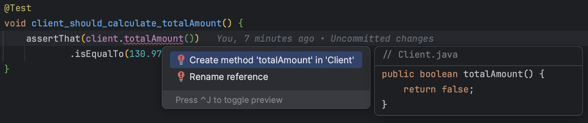

## Day 9: Fix the code.

`What's the problem with this code?`

```java
public class Client {
    private final Map<String, Double> orderLines;
    private double totalAmount;

    public Client(Map<String, Double> orderLines) {
        this.orderLines = orderLines;
    }

    public String toStatement() {
        return orderLines.entrySet().stream()
                .map(entry -> formatLine(entry.getKey(), entry.getValue()))
                .collect(Collectors.joining(System.lineSeparator()))
                .concat(System.lineSeparator() + "Total : " + totalAmount + "€");
    }

    private String formatLine(String name, Double value) {
        totalAmount += value;
        return name + " for " + value + "€";
    }

    public double getTotalAmount() {
        return totalAmount;
    }
}
```

- The public method `toStatement` has a signature like this: `void` -> `String`
  - From the outside, it is a query method that simply returns data
  - But here is the problem if we look closer the implementation... 
    - Each time we call the `toStatement` method it will mutate the internal state of the object...
    - It will update the `totalAmount` meaning that the second time we call the method the result will be wrong

> "Asking a question should not change the answer" - Bertrand Meyer

We will apply the [`Command Query Separation` principle](https://xtrem-tdd.netlify.app/Flavours/command-query-separation) to fix this problem.


|             | Returns  |           Side Effect           |
|-------------|:--------:|:-------------------------------:|
| **Query**   | a result |              None               |
| **Command** |   void   | changes the state of the system |

- `Queries` return a result without side effects on the system
  - We can call queries from anywhere, multiple times and in various orders
- `Commands` will affect the system but won't return any result. Therefore
  - The state will be different before and after a command
- A method cannot be both (returning a value and producing a side effect)

The `toStatement` method precisely belongs to both categories.

Let's fix it...

🔴 Let's write a failing test expressing the behavior we want to isolate (calculate total amount)

```java
@Test
void client_should_calculate_totalAmount() {
    assertThat(client.totalAmount())
            .isEqualTo(130.97);
}
```

- We generate the code from the test



🟢 Make it pass `as fast as possible`

```java
public Double totalAmount() {
    return 130.97;
}
```

🔵 We refactor the method to use the `stream` api

```java
public Double totalAmount() {
    return orderLines.values()
            .stream()
            .mapToDouble(x -> x)
            .sum();
}
```

- We can now use the `totalAmount` method from `toStatement`

```java
public String toStatement() {
    return orderLines.entrySet().stream()
            .map(entry -> formatLine(entry.getKey(), entry.getValue()))
            .collect(Collectors.joining(System.lineSeparator()))
            .concat(System.lineSeparator() + "Total : " + totalAmount() + "€");
}
```

- We fix the `formatLine` method

```java
private String formatLine(String name, Double value) {
    return name + " for " + value + "€";
}
```

- We fix the test as well

```java
@Test
void client_should_return_statement() {
    assertThat(client.toStatement()).isEqualTo(
            "Tenet Deluxe Edition for 45.99€" + lineSeparator() +
                    "Inception for 30.5€" + lineSeparator() +
                    "The Dark Knight for 30.5€" + lineSeparator() +
                    "Interstellar for 23.98€" + lineSeparator() +
                    "Total : 130.97€");
}
```

- We can now remove the `totalAmount` field


- We improve the code a little bit as well to end-up with a code like this

```java
public class Client {
    private final Map<String, Double> orderLines;

    public Client(Map<String, Double> orderLines) {
        this.orderLines = orderLines;
    }

    public String toStatement() {
        return orderLines.entrySet()
                .stream()
                .map(entry -> formatLine(entry.getKey(), entry.getValue()))
                .collect(joining(lineSeparator(), "", formatTotal()));
    }

    private String formatLine(String name, Double value) {
        return name + " for " + value + "€";
    }

    private String formatTotal() {
        return lineSeparator() + "Total : " + totalAmount() + "€";
    }

    public Double totalAmount() {
        return orderLines.values()
                .stream()
                .mapToDouble(x -> x)
                .sum();
    }
}
```