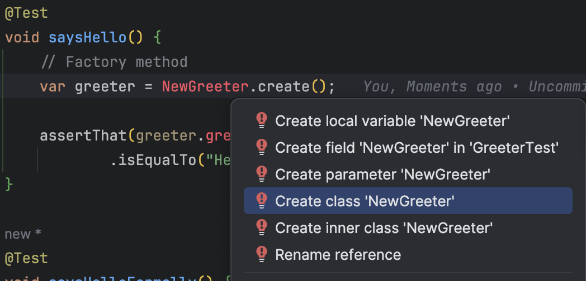

## Day 12: Make the code tend to be Open for extension / closed for modification.

> We don't want to have to modify our existing, working code to add something new. 

Here if we need to a new `formality` we have to change the logic to add a new branch in the `greet` method...

```java
public class Greeter {
    String formality;

    public String greet() {
        if (this.formality == null) {
            return "Hello.";
        }

        if (this.formality.equals("formal")) {
            return "Good evening, sir.";
        } else if (this.formality.equals("casual")) {
            return "Sup bro?";
        } else if (this.formality.equals("intimate")) {
            return "Hello Darling!";
        } else {
            return "Hello.";
        }
    }

    public void setFormality(String formality) {
        this.formality = formality;
    }
}
```

- Let's add a robot `formality`

```java
public String greet() {
    if (this.formality == null) {
        return "Hello.";
    }

    if (this.formality.equals("formal")) {
        return "Good evening, sir.";
    } else if (this.formality.equals("casual")) {
        return "Sup bro?";
    } else if (this.formality.equals("intimate")) {
        return "Hello Darling!";
    } else if(this.formality.equals("robot")) {
        return """
                                                                                                                                  \s
            ,--.  ,--.       ,--.,--.            ,---.                                                      ,--.            ,--.  \s
            |  '--'  | ,---. |  ||  | ,---.     /  .-',--.--. ,---. ,--,--,--.     ,--,--.    ,--.--. ,---. |  |-.  ,---. ,-'  '-.\s
            |  .--.  || .-. :|  ||  || .-. |    |  `-,|  .--'| .-. ||        |    ' ,-.  |    |  .--'| .-. || .-. '| .-. |'-.  .-'\s
            |  |  |  |\\   --.|  ||  |' '-' '    |  .-'|  |   ' '-' '|  |  |  |    \\ '-'  |    |  |   ' '-' '| `-' |' '-' '  |  |  \s
            `--'  `--' `----'`--'`--' `---'     `--'  `--'    `---' `--`--`--'     `--`--'    `--'    `---'  `---'  `---'   `--'  \s
                       
            """;

    }
    else {
        return "Hello.";
    }
}
```

Maybe, there is a better way to design this code 🤔

Instead, of those `if, else` we may have a high-level `Greeter` class that is instantiated with some `Personality`... we don't know which yet, just that it will be some object that implements the `Personality`.

We may imagine to design something like this:


### Apply the Open-Closed Principle
Know more about [S.O.L.I.D](https://www.freecodecamp.org/news/solid-design-principles-in-software-development/) and [C.U.P.I.D](https://dannorth.net/cupid-for-joyful-coding/).

🔴 Let's express this design from an existing test



- We create the `NewGreeter` interface from our test

```java
public interface NewGreeter {
    // Factory method
    static NewGreeter create() {
        return null;
    }

    String greet();
}
```

- Our test is now failing for a good reason


🟢 Let's adapt the implementation to fulfill expectations from our test

```java
public interface NewGreeter {
    static NewGreeter create() {
        return new DefaultGreeter();
    }

    // use default method from interface
    default String greet() {
        return "Hello.";
    }

    class DefaultGreeter implements NewGreeter { }
}
```

🔵 Anything to refactor?

🔴 Let's adapt other tests

```java
@Test
void saysHelloFormally() {
    var greeter = NewGreeter.create("formal");

    assertThat(greeter.greet())
            .isEqualTo("Good evening, sir.");
}
```

🟢 We create a new class and create method

```java
static NewGreeter create(String formality) {
    return new FormalPersonality();
}

class FormalPersonality implements NewGreeter {
    @Override
    public String greet() {
        return "Good evening, sir.";
    }
}
```

After a few iterations, our code looks like this :

```java
public interface NewGreeter {
    static NewGreeter create() {
        return new DefaultGreeter();
    }

    static NewGreeter create(String formality) {
        return switch (formality) {
            case "casual" -> new Casual();
            case "intimate" -> new Intimate();
            default -> new Formal();
        };
    }

    default String greet() {
        return "Hello.";
    }

    class DefaultGreeter implements NewGreeter {
    }

    class Formal implements NewGreeter {
        @Override
        public String greet() {
            return "Good evening, sir.";
        }
    }

    class Casual implements NewGreeter {
        @Override
        public String greet() {
            return "Sup bro?";
        }
    }

    class Intimate implements NewGreeter {
        @Override
        public String greet() {
            return "Hello Darling!";
        }
    }
}
```

🔵 We can remove the old `Greeter` class (no more caller)


- Rename `NewGreeter` to `Greeter`
- Refactor the tests to have less duplication
  - If we prepare our refactoring, our IDE can help us save so much time 😊


- Tests look like this now

```java
@Test
void saysHello() {
    assertGreet(Greeter.create(), "Hello.");
}

@Test
void saysHelloFormally() {
    assertGreet(
            Greeter.create("formal"),
            "Good evening, sir."
    );
}

@Test
void saysHelloCasually() {
    assertGreet(
            Greeter.create("casual"),
            "Sup bro?"
    );
}

@Test
void saysHelloIntimately() {
    assertGreet(
            Greeter.create("intimate"),
            "Hello Darling!"
    );
}
```

- Let's extract `constants`

```java
String CASUAL = "casual";
String INTIMATE = "intimate";
String FORMAL = "formal";

static Greeter create() {
    return new Default();
}

static Greeter create(String formality) {
    return switch (formality) {
        case CASUAL -> new Casual();
        case INTIMATE -> new Intimate();
        case FORMAL -> new Formal();
        default -> new Default();
    };
}
```

> To create a new formality we will have to implement a new Greeter class and add en entry in the factory method 

### Refactor to Map Function - Bonus
In `OOP` this kind of mechanism may seem heavy... we can use a `functional map` a.k.a function registration to make it less heavy

```java
public class GreeterFactory {
    public static final String CASUAL = "casual";
    public static final String INTIMATE = "intimate";
    public static final String FORMAL = "formal";
    private static final Map<String, Greeter> mapping = Map.of(
            CASUAL, () -> "Sup bro?",
            FORMAL, () -> "Good evening, sir.",
            INTIMATE, () -> "Hello Darling!"
    );

    public static Greeter create(String formality) {
        return mapping.getOrDefault(formality, create());
    }

    public static Greeter create() {
        return () -> "Hello.";
    }
    
    public interface Greeter extends Supplier<String> {
    }
}
```