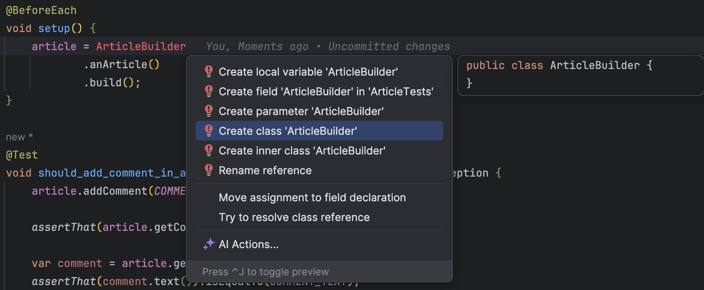

## Day 13: Find a way to eliminate the irrelevant, and amplify the essentials of those tests.

We can use [`Test Data Buidler`](https://xtrem-tdd.netlify.app/Flavours/test-data-builders) pattern to achieve this
purpose.

It will:

- `Facilitate writing` tests by allowing easy creation of inputs or expected data.
- `Improve test maintainability` by decoupling the creation of objects in tests, and isolating it in a single
  location (Single Responsibility Principle)
- Disseminate `functional understanding` in the team through the use of business terms
- Facilitate the `readability of the tests` by explaining only the data implied in the use case

- We need to identify what is irrelevant and what is essentials in those tests:

```java
class ArticleTests {
    // Those constants do not influence outcomes of the behavior
    public static final String AUTHOR = "Pablo Escobar";
    private static final String COMMENT_TEXT = "Amazing article !!!";
    private Article article;

    @BeforeEach
    void setup() {
        // Article's name and content are irrelevant as well
        article = new Article(
                "Lorem Ipsum",
                "consectetur adipiscing elit, sed do eiusmod tempor incididunt ut labore"
        );
    }

    @Test
    void should_add_comment_in_an_article() throws CommentAlreadyExistException {
        article.addComment(COMMENT_TEXT, AUTHOR);

        assertThat(article.getComments()).hasSize(1);

        var comment = article.getComments().get(0);
        assertThat(comment.text()).isEqualTo(COMMENT_TEXT);
        assertThat(comment.author()).isEqualTo(AUTHOR);
    }

    @Test
    void should_add_comment_in_an_article_containing_already_a_comment() throws CommentAlreadyExistException {
        // Values are not relevant
        var newComment = "Finibus Bonorum et Malorum";
        var newAuthor = "Al Capone";

        // Essential to know that it already contains a comment
        article.addComment(COMMENT_TEXT, AUTHOR);
        article.addComment(newComment, newAuthor);

        assertThat(article.getComments()).hasSize(2);

        var lastComment = article.getComments().getLast();
        assertThat(lastComment.text()).isEqualTo(newComment);
        assertThat(lastComment.author()).isEqualTo(newAuthor);
    }

    @Nested
    class Fail {
        @Test
        void when__adding_an_existing_comment() throws CommentAlreadyExistException {
            article.addComment(COMMENT_TEXT, AUTHOR);

            assertThatThrownBy(() -> {
                article.addComment(COMMENT_TEXT, AUTHOR);
            }).isInstanceOf(CommentAlreadyExistException.class);
        }
    }
}
```

- Let's create a `Test Data Builder` for the `Article`
    - We would like something like this

```java
@BeforeEach
void setup() {
        article = ArticleBuilder
        .anArticle()
        .build();
}
```

- We then [`generate code from usage`](https://xtrem-tdd.netlify.app/Flavours/generate-code-from-usage)



- After code genrationg, we end up with a class like this

```java
public class ArticleBuilder {
    public static ArticleBuilder anArticle() {
        return null;
    }

    public Article build() {
        return null;
    }
}
```

- We implement the builder (simplest as possible)

```java
public class ArticleBuilder {
    public static ArticleBuilder anArticle() {
        return new ArticleBuilder();
    }

    public Article build() {
        return new Article(
                "Lorem Ipsum",
                "consectetur adipiscing elit, sed do eiusmod tempor incididunt ut labore"
        );
    }
}
```

- We want to use it in the `should_add_comment_in_an_article_containing_already_a_comment` test
    - We need to manipulate the `Builder` itself in the test and not an `Article`


- We adapt the tests for that

```java
class ArticleTests {
    public static final String AUTHOR = "Pablo Escobar";
    private static final String COMMENT_TEXT = "Amazing article !!!";
    private ArticleBuilder articleBuilder;

    @BeforeEach
    void setup() {
        articleBuilder = anArticle();
    }

    @Test
    void should_add_comment_in_an_article() throws CommentAlreadyExistException {
        var article = articleBuilder.build();
        article.addComment(COMMENT_TEXT, AUTHOR);

        assertThat(article.getComments()).hasSize(1);

        var comment = article.getComments().get(0);
        assertThat(comment.text()).isEqualTo(COMMENT_TEXT);
        assertThat(comment.author()).isEqualTo(AUTHOR);
    }

    @Test
    void should_add_comment_in_an_article_containing_already_a_comment() throws CommentAlreadyExistException {
        var newComment = "Finibus Bonorum et Malorum";
        var newAuthor = "Al Capone";
        var article = articleBuilder
                .commented()
                .build();

        article.addComment(newComment, newAuthor);

        assertThat(article.getComments()).hasSize(2);

        var lastComment = article.getComments().getLast();
        assertThat(lastComment.text()).isEqualTo(newComment);
        assertThat(lastComment.author()).isEqualTo(newAuthor);
    }

    @Nested
    class Fail {
        @Test
        void when__adding_an_existing_comment() throws CommentAlreadyExistException {
            var article = articleBuilder.build();
            article.addComment(COMMENT_TEXT, AUTHOR);

            assertThatThrownBy(() -> {
                article.addComment(COMMENT_TEXT, AUTHOR);
            }).isInstanceOf(CommentAlreadyExistException.class);
        }
    }
}
```

- We iterate on the `builder`

```java
public class ArticleBuilder {
    // Object Mother
    public static final String AUTHOR = "Pablo Escobar";
    public static final String COMMENT_TEXT = "Amazing article !!!";
    private final HashMap<String, String> comments;

    public ArticleBuilder() {
        comments = new HashMap<>();
    }

    public static ArticleBuilder anArticle() {
        return new ArticleBuilder();
    }

    public ArticleBuilder commented() {
        this.comments.put(COMMENT_TEXT, AUTHOR);
        return this;
    }

    // Only one place from our tests that contains this construction logic
    // If Article constructor changes, we just have to change this Builder and not the 1000 related tests...
    public Article build() throws CommentAlreadyExistException {
        var article = new Article(
                "Lorem Ipsum",
                "consectetur adipiscing elit, sed do eiusmod tempor incididunt ut labore"
        );
        for (Map.Entry<String, String> comment : comments.entrySet()) {
            article.addComment(comment.getKey(), comment.getValue());
        }
        return article;
    }
}
```

- Let's improve readability of our tests by
    - simplifying them
    - removing duplication

- We extract the `assertion` method in a method


- Our IDE detects the duplication and help us


- Our tests now look like this

```java
class ArticleTests {
    private ArticleBuilder articleBuilder;

    @BeforeEach
    void setup() {
        articleBuilder = anArticle();
    }

    @Test
    void should_add_comment_in_an_article() throws CommentAlreadyExistException {
        final var article = articleBuilder.build();
        article.addComment(ArticleBuilder.COMMENT_TEXT, ArticleBuilder.AUTHOR);

        assertThat(article.getComments()).hasSize(1);
        assertComment(article.getComments().get(0), ArticleBuilder.COMMENT_TEXT, ArticleBuilder.AUTHOR);
    }

    @Test
    void should_add_comment_in_an_article_containing_already_a_comment() throws CommentAlreadyExistException {
        final var newComment = "Finibus Bonorum et Malorum";
        final var newAuthor = "Al Capone";

        var article = articleBuilder
                .commented()
                .build();

        article.addComment(newComment, newAuthor);

        assertThat(article.getComments()).hasSize(2);
        assertComment(article.getComments().getLast(), newComment, newAuthor);
    }

    @Nested
    class Fail {
        @Test
        void when__adding_an_existing_comment() throws CommentAlreadyExistException {
            final var article = articleBuilder.build();
            article.addComment(ArticleBuilder.COMMENT_TEXT, ArticleBuilder.AUTHOR);

            assertThatThrownBy(() -> {
                article.addComment(ArticleBuilder.COMMENT_TEXT, ArticleBuilder.AUTHOR);
            }).isInstanceOf(CommentAlreadyExistException.class);
        }
    }

    private static void assertComment(Comment comment, String commentText, String author) {
        assertThat(comment.text()).isEqualTo(commentText);
        assertThat(comment.author()).isEqualTo(author);
    }
}
```

### Bonus

We could remove call to the builder from the tests by creating a DSL and using `Higher Order Function`.

```java
class ArticleBonusTests {
    private Article article;

    @Test
    void should_add_comment_in_an_article() throws CommentAlreadyExistException {
        when(article -> article.addComment(COMMENT_TEXT, AUTHOR));
        then(article -> {
            assertThat(article.getComments()).hasSize(1);
            assertComment(article.getComments().get(0), COMMENT_TEXT, AUTHOR);
        });
    }

    @Test
    void should_add_comment_in_an_article_containing_already_a_comment() throws Throwable {
        final var newComment = create(String.class);
        final var newAuthor = create(String.class);

        when(ArticleBuilder::commented, article -> article.addComment(newComment, newAuthor));
        then(article -> {
            assertThat(article.getComments()).hasSize(2);
            assertComment(article.getComments().getLast(), newComment, newAuthor);
        });
    }

    @Nested
    class Fail {
        @Test
        void when__adding_an_existing_comment() throws CommentAlreadyExistException {
            var article = anArticle()
                    .commented()
                    .build();

            assertThatThrownBy(() -> {
                article.addComment(article.getComments().get(0).text(), article.getComments().get(0).author());
            }).isInstanceOf(CommentAlreadyExistException.class);
        }
    }

    private static void assertComment(Comment comment, String commentText, String author) {
        assertThat(comment.text()).isEqualTo(commentText);
        assertThat(comment.author()).isEqualTo(author);
    }

    private void when(ArticleBuilder articleBuilder, ThrowingConsumer<Article> act) throws CommentAlreadyExistException {
        article = articleBuilder.build();
        act.accept(article);
    }

    private void when(ThrowingConsumer<Article> act) throws CommentAlreadyExistException {
        when(anArticle(), act);
    }

    private void when(Function<ArticleBuilder, ArticleBuilder> options, ThrowingConsumer<Article> act) throws Throwable {
        when(options.apply(anArticle()), act);
    }

    private void then(ThrowingConsumer<Article> act) {
        act.accept(article);
    }
}
```

- We could also use a library to get random `String` data for our tests (they do not impact the results of the behavior and create noise)
  - We can use `Instancio` to do so

```xml
<dependency>
    <groupId>org.instancio</groupId>
    <artifactId>instancio-junit</artifactId>
    <version>${instancio-junit.version}</version>
    <scope>test</scope>
</dependency>
```

- By using it, it makes explicit that some required data do not influence the behavior

```java
@Test
void should_add_comment_in_an_article_containing_already_a_comment() throws Throwable {
    final var newComment = create(String.class);
    final var newAuthor = create(String.class);

    when(ArticleBuilder::commented, article -> article.addComment(newComment, newAuthor));
    then(article -> {
        assertThat(article.getComments()).hasSize(2);
        assertComment(article.getComments().getLast(), newComment, newAuthor);
    });
}
```
