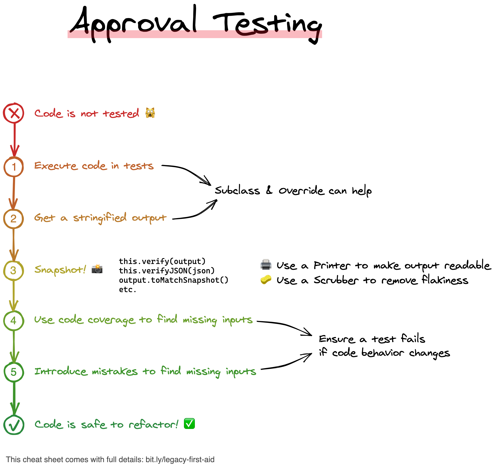
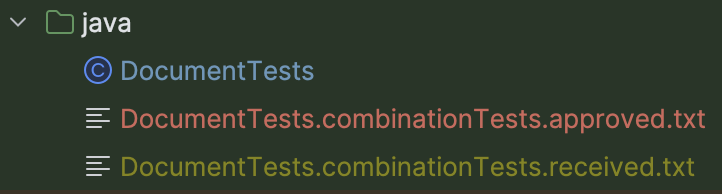
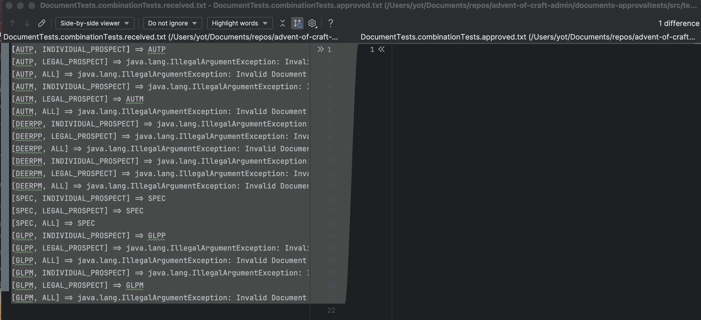

## Day 15: Put a code under tests.
- Imagine we need to adapt the code below to support a new document template
  - We want to be sure to not introduce regression / have a safety net

```java
public enum DocumentTemplateType {
    DRP("DEER", I),
    DPM("DEER", L),
    ATP("AUTP", I),
    ATM("AUTM", L),
    SPEC("SPEC", ALL),
    GLP("GLPP", I),
    GLM("GLPM", L);

    private final String documentType;
    private final RecordType recordType;

    DocumentTemplateType(String documentType, RecordType recordType) {
        this.documentType = documentType;
        this.recordType = recordType;
    }

    public static DocumentTemplateType fromDocumentTypeAndRecordType(String documentType, String recordType) {
        for (DocumentTemplateType dtt : DocumentTemplateType.values()) {
            if (dtt.getDocumentType().equalsIgnoreCase(documentType)
                    && dtt.getRecordType().equals(RecordType.valueOf(recordType))) {
                return dtt;
            } else if (dtt.getDocumentType().equalsIgnoreCase(documentType)
                    && dtt.getRecordType().equals(ALL)) {
                return dtt;
            }
        }
        throw new IllegalArgumentException("Invalid Document template type or record type");
    }

    private RecordType getRecordType() {
        return recordType;
    }

    private String getDocumentType() {
        return documentType;
    }
}
```

- Let's add some tests
  - We have plenty of possible combinations
  - We could use `ParameterizedTests` to make those assertions

```java
@Test
void given_glpp_and_individual_prospect_should_return_glpp() {
    final var result = DocumentTemplateType.fromDocumentTypeAndRecordType("GLPP", "INDIVIDUAL_PROSPECT");
    assertThat(result).isEqualTo(DocumentTemplateType.GLPP);
}

@Test
void given_glpp_and_legal_prospect_should_fail() {
    assertThrows(IllegalArgumentException.class,
            () -> DocumentTemplateType.fromDocumentTypeAndRecordType("GLPP", "LEGAL_PROSPECT"));
}
```

### Use Approval Testing instead
We can use `Approval Testing` to quickly put legacy code under tests.

Learn more about it [here](https://understandlegacycode.com/approval-tests/).

It is also called : `Characterization Tests` OR `Golden Master`
- Unit testing assertions can be difficult to use and long to write
- Approval tests simplify this by taking a snapshot of the results / confirming that they have not changed at each run


We add [ApprovalTests](https://github.com/approvals/approvaltests.java) dependency in our pom

```xml
<properties>
  <approvaltests.version>22.3.2</approvaltests.version>
</properties>

<dependencies>
  <dependency>
    <groupId>com.approvaltests</groupId>
    <artifactId>approvaltests</artifactId>
    <version>${approvaltests.version}</version>
  </dependency>
</dependencies>
```

- Add `.gitignore` file to exclude `*.received.*` from git

```text
### Approval exclusion ###
*.received.*
```

- Instead, let's use the power of Approval !!!



- We can generate combinations and have only 1 test (golden master) using `CombinationApprovals.verifyAllCombinations`


- We use all the possible values as inputs
  - It will make a cross product for the test

```java
@Test
void combinationTests() {
    CombinationApprovals.verifyAllCombinations(
            DocumentTemplateType::fromDocumentTypeAndRecordType,
            new String[]{"AUTP", "AUTM", "DEERPP", "DEERPM", "SPEC", "GLPP", "GLPM"},
            new String[]{"INDIVIDUAL_PROSPECT", "LEGAL_PROSPECT", "ALL"}
    );
}
```

- On the first run, 2 files are created
  - `DocumentTests.combinationTests.received.txt`: the result of the call of the method under test
  - `DocumentTests.combinationTests.approved.txt`: the approved version of the result (approved manually)



- The library simply compare the 2 text files, so it fails the first time you run it


- It compares the actual result and an empty file



- We need to approve the `received` file to make the test passes
  - Meaning we create the `approved` one with the result of the current production code

```bash
cp src/test/java/DocumentTests.combinationTests.received.txt src/test/java/DocumentTests.combinationTests.approved.txt 
```

### Refactoring time
- We can even improve the test by making it totally dynamic
  - If we add a new Enum entry the test will fail
  - Forcing us to approve the new version of the test output

```java
@Test
void combinationTests() {
    verifyAllCombinations(
            DocumentTemplateType::fromDocumentTypeAndRecordType,
            Arrays.stream(DocumentTemplateType.values()).map(Enum::name).toArray(String[]::new),
            Arrays.stream(RecordType.values()).map(Enum::name).toArray(String[]::new)
    );
}
```

- In just a few minutes, we have successfully covered a cryptic code with robust tests


> We are now ready for refactoring... 😉

- We refactor the production code 

```java
private static final Map<String, DocumentTemplateType> mapping =
        List.of(DocumentTemplateType.values())
                .toMap(v -> formatKey(v.getDocumentType(), v.getRecordType().name()), v -> v)
                .merge(List.of(RecordType.values()).toMap(v -> formatKey(SPEC.name(), v.name()), v -> SPEC));

private static String formatKey(String documentType, String recordType) {
    return documentType.toUpperCase() + "-" + recordType.toUpperCase();
}

public static DocumentTemplateType fromDocumentTypeAndRecordType(String documentType, String recordType) {
    return mapping.get(formatKey(documentType, recordType))
            .getOrElseThrow(() -> new IllegalArgumentException("Invalid Document template type or record type"));
}
```