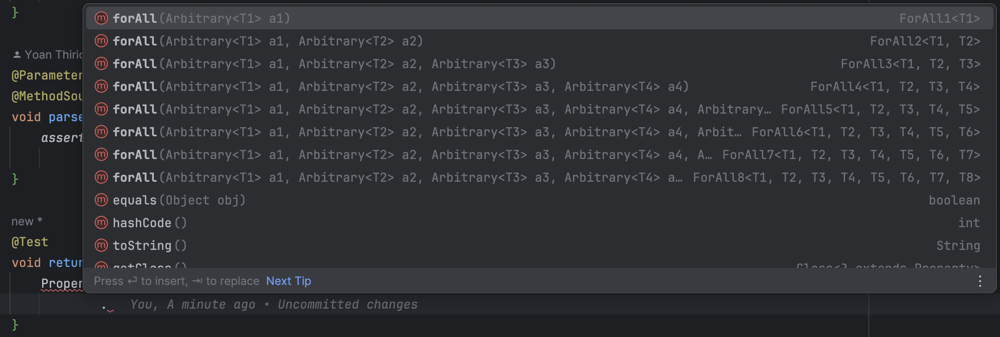
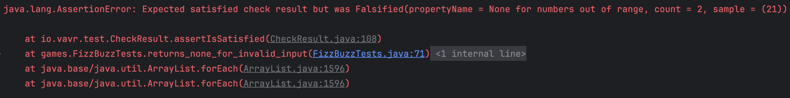

## Day 17: Design one test that has the impact of thousands.

`How could we design one test that has the impact of thousands?`

We can use [`Property-Based Testing`](https://xtrem-tdd.netlify.app/flavours/pbt/). Here we choose to use the
library [`vavr-test`](https://github.com/vavr-io/vavr-test)(you may use alternatives like `junit quickcheck` for
example).

When we use this technique, we need to think in terms of property.
Here are some `Use Cases` that may inspire you during this kind of reflection :

- Verify **idempotence**
    - `f(f(x)) == f(x)`
    - ex : UpperCase, Create / Delete
- Verify **round-tripping**
    - `from(to(x)) == x`
    - ex : Serialization, PUT / GET, Reverse, Negate
- Check **invariants** (universal properties)
    - `invariant(f(x)) == invariant(x)`
    - ex : Reverse, Map
- Check **commutativity**
    - `f(x, y) == f(y, x)`
    - ex : Addition, Min, Max
- Verify **re-writing / refactoring**
    - `f(x) == new_f(x)`
    - When rewriting, optimizing or refactoring an implementation
- To upgrade **parameterized tests**
    - To replace hardcoded values / discover new test cases (edge cases)

### Property list

- Think about what could go wrong:

```text
for all (invalidInput)
such that convert(invalidInput) is none
```

- At least one character for a valid input
    - The input itself
    - Or in a given list: "Fizz", "Buzz", "FizzBuzz"

```text
for all (validInput)
such that convert(validInput) is a string looking matching one item from the list: validInput, "Fizz", "Buzz", "FizzBuzz"
```

> Be careful when designing properties to not leaking implementation in your test (typically have the modulo logic
> duplicated in a property).

### Write a first property

We use the discoverability of the library to start implementing it.



- Create input
  

- We use `Arbitrary` class to generate `invalidInput`

```java
// A classic Unit Test
@Test
void returns_none_for_invalid_input(){
    Arbitrary<Integer> invalidInput=Arbitrary.integer().filter(x->x< 1||x>100);

    // Define a property
    Property.def("None for numbers out of range")
            .forAll(invalidInput)
            // Define the predicate
            .suchThat(x->FizzBuzz.convert(x).isEmpty())
            .check()
            // Necessary fo asserting -> junit
            .assertIsSatisfied();
}
```

- Our property is green
    - `Never trust a test that have not seen failed`
    - Let's make it fail by not filtering the `Integer` for example



- It fails after 2 runs with value: `21`
    - If we run it again, it will fail for another value
    - `Never rerun a property on failure`: isolate the identified sample in a Unit Test

- We refactor it a little bit (import static, use constants)

```java
@Test
void parse_fail_for_numbers_out_of_range(){
    def("None for numbers out of range")
        .forAll(integer().filter(x->x<MIN ||x>MAX))
        .suchThat(x->FizzBuzz.convert(x).isEmpty())
        .check()
        .assertIsSatisfied();
}
```

- We can now delete the `non passing` test (it is covered by our property)

```java
public static Stream<Arguments> invalidInputs(){
    return Stream.of(
        Arguments.of(0),
        Arguments.of(-1),
        Arguments.of(101)
    );
}

@ParameterizedTest
@MethodSource("invalidInputs")
void parse_fail_for_numbers_out_of_range(int input){
      assertThat(FizzBuzz.convert(input).isEmpty())
              .isTrue();
}
```

### Write the "valid" property

- We express this new property

```java
@Test
void parse_return_valid_string_for_numbers_between_1_and_100(){
    def("Some(validString) for numbers in [1; 100]")
      .forAll(integer().filter(x->x>=MIN&&x<=MAX))
      .suchThat(x->FizzBuzz.convert(x).exists(s->Seq("Fizz","Buzz","FizzBuzz",x.toString()).contains(s)))
      .check()
      .assertIsSatisfied();
}
```

- Let's refactor it to make it simpler to understand

```java
class FizzBuzzTests {
    private static final Seq<String> fizzBuzzStrings = List("Fizz", "Buzz", "FizzBuzz");

    public static Stream<Arguments> validInputs() {
        return Stream.of(
                Arguments.of(1, "1"),
                Arguments.of(67, "67"),
                Arguments.of(82, "82"),
                Arguments.of(3, "Fizz"),
                Arguments.of(66, "Fizz"),
                Arguments.of(99, "Fizz"),
                Arguments.of(5, "Buzz"),
                Arguments.of(50, "Buzz"),
                Arguments.of(85, "Buzz"),
                Arguments.of(15, "FizzBuzz"),
                Arguments.of(30, "FizzBuzz"),
                Arguments.of(45, "FizzBuzz")
        );
    }

    @ParameterizedTest
    @MethodSource("validInputs")
    void parse_successfully_numbers_between_1_and_100_samples(int input, String expectedResult) {
        assertThat(FizzBuzz.convert(input))
                .isEqualTo(Some(expectedResult));
    }

    @Test
    void parse_return_valid_string_for_numbers_between_1_and_100() {
        def("Some(validString) for numbers in [1; 100]")
                .forAll(validInput())
                .suchThat(this::isConvertValid)
                .check()
                .assertIsSatisfied();
    }

    @Test
    void parse_fail_for_numbers_out_of_range() {
        def("None for numbers out of range")
                .forAll(invalidInput())
                .suchThat(x -> FizzBuzz.convert(x).isEmpty())
                .check()
                .assertIsSatisfied();
    }

    private boolean isConvertValid(Integer x) {
        return FizzBuzz.convert(x)
                .exists(s -> validStringsFor(x).contains(s));
    }

    private static Arbitrary<Integer> validInput() {
        return integer().filter(x -> x >= MIN && x <= MAX);
    }

    private static Seq<String> validStringsFor(Integer x) {
        return fizzBuzzStrings.append(x.toString());
    }

    private static Arbitrary<Integer> invalidInput() {
        return integer().filter(x -> x < MIN || x > MAX);
    }
}
```

We won't remove the test `parse_successfully_numbers_between_1_and_100_samples`, why?