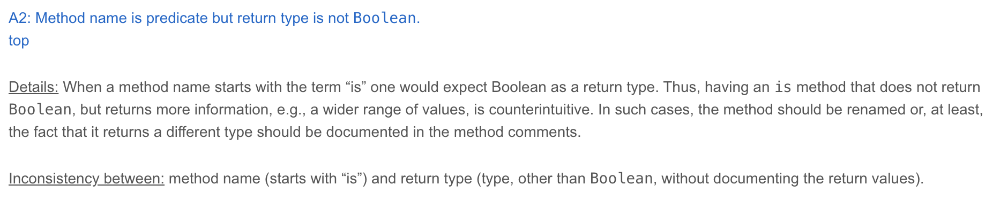
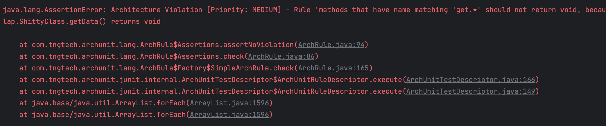

## Day 18: Automatically detect Linguistic Anti-Patterns (LAP).

`What's the problem with this code?` (except the name's class 😁)

```java
public class ShittyClass {
    // getter that returns void...
    public void getData() {
    }

    // an is method returning an integer...
    private int isTrue() {
        return 42;
    }
}
```

This kind of issues in the code are [`Linguistic Anti Patterns`](https://www.veneraarnaoudova.ca/linguistic-anti-pattern-detector-lapd/las/) as named by [Venera Arnaoudova](https://www.veneraarnaoudova.ca/).



> How could we simply detect these issues?

### Architecture Unit Tests
Take a look at [this page](https://xtrem-tdd.netlify.app/Flavours/archunit) describing this concept.

- We can use the library [`archunit`](https://www.archunit.org/) in java to describe and enforce architecture / design rules.

```xml
<properties>
    <archunit-junit5.version>1.2.0</archunit-junit5.version>
</properties>

<dependencies>
    <dependency>
        <groupId>com.tngtech.archunit</groupId>
        <artifactId>archunit-junit5</artifactId>
        <version>${archunit-junit5.version}</version>
        <scope>test</scope>
    </dependency>
</dependencies>
```

- We can now create a test class to materialize this kind of guideline
  - We use the `@AnalyzeClasses` annotation and configure which packages need to be analyzed

```java
@AnalyzeClasses(packages = "lap", importOptions = ImportOption.DoNotIncludeTests.class)
public class TeamRules {
}
```

- Even if we are not expert in this library, its discoverability makes it really easy to use and learn
  - Read more about [`Dot Driven Development`](https://blog.ploeh.dk/2012/05/25/Designpatternsacrossparadigms/#ebe4a8c5ba664c6fb5ea07c8b7e18555)


#### No getter can return `void`
- We write a skeleton of this rule

```java
@ArchTest
public static final ArchRule no_getter_can_return_void =
        ArchRuleDefinition
                // Work on the methods
                .methods().that()
                // Specify a regex to select the ones we are interested in
                .haveNameMatching("get.*")
                // Set our expectation
                .should(notBeVoid())
                .because("any method which gets something should actually return something");
```

- We generate the `notBeVoid` method
  - Then adapt it like this:

```java
public static ArchCondition<JavaMethod> notBeVoid() {
    return new ArchCondition<>("not return void") {
        @Override
        public void check(JavaMethod method, ConditionEvents events) {
            final var matches = !"void".equals(method.getRawReturnType().getName());
            final var message = method.getFullName() + " returns " + method.getRawReturnType().getName();
            events.add(new SimpleConditionEvent(method, matches, message));
        }
    };
}
```

- Once done, we run the tests
  - The anti-pattern is detected



- We can check that it works correctly by fixing the code and run the tests again

```java
public int getData() {
    return 42;
}
```

- The test is green, our LA detection is working like a charm

#### Iser / haser must return a `boolean`
- We work on `is` detection now

```java
@ArchTest
private static final ArchRule iser_haser_must_return_boolean =
      methods().that().haveNameMatching("is[A-Z].*")
              .or().haveNameMatching("has[A-Z].*")
              .should().haveRawReturnType(Boolean.class)
              .orShould().haveRawReturnType(boolean.class)
              .because("any method which fetch a state should actually return something (a boolean)");
```

#### Let's detect bad names
- Based on Simon Butler's work, we can try to detect bad naming in our code
  - The ones which increase drastically our cognitive load while reading code...

| Name                                        | Description                                                                                                                  | Example of a bad name                       |
| ------------------------------------------- | ---------------------------------------------------------------------------------------------------------------------------- | ------------------------------------------- |
| Capitalization Anomaly                      | Identifiers should use proper capitalization.                                                                                | page counter                                |
| Consecutive underscores                     | Identifiers should not contain multiple consecutive underscores.                                                             | page__counter                               |
| Dictionary words                            | Identifiers should consist of words, and only use abbreviations when they are more commonly used than the full words.        | pag_countr                                  |
| Number of Words                             | Identifiers should be composed of between two and four words.                                                                | page_counter_ <br> converted_and_ <br> normalized_value |
| Excessive words                             | Identifiers should not be composed out of more than four words.                                                              | page_counter_ <br> converted_and_ <br> normalized_value |
| Short Identifier Name                       | Identifiers should not consist of fewer than eight characters, except for c, d, e, g, i, in, inOut, j, k, m, n, o, out, t, x, y, z. | P, page                                      |
| Enumeration Identifier Declaration Order    | Unless there are clear reasons to do so, enumeration types should be declared in alphabetical order.                         | CardValue = {ACE, EIGHT, FIVE, FOUR, JACK, KING...} |
| External Underscores                        | Identifiers should not begin or end in an underscore.                                                                        | __page_counter_                             |
| Identifier Encoding                         | Type information should not be encoded in identifier names using Hungarian notation or similar.                               | int_page_counter                            |
| Long Identifier Name                        | Long identifier names should be avoided where possible.                                                                      | page_counter_ <br> converted_and_ <br> normalized_value |
| Naming Convention Anomaly                   | Identifiers should not combine uppercase and lowercase characters in non-standard ways.                                       | Page_counter                                |
| Numeric Identifier Name                     | Identifiers should not be composed entirely of numeric words or numbers.                                                     | FIFTY                                       |

> More explanations regarding those concepts [here](https://www.researchgate.net/scientific-contributions/Simon-Butler-2163532599)

- We write 2 rules to detect `underscore anomalies`

```java
@ArchTest
private static final ArchRule detect_consecutives_underscores =
        fields().that()
                .haveNameMatching(".*__.*")
                .should(notExist("not contain consecutive underscores..."))
                .because("it ruins readability");

@ArchTest
private static final ArchRule detect_external_underscores =
        fields().that()
                .haveNameMatching("_.*|\\w+._")
                .should(notExist("not contain external underscores..."))
                .because("it ruins readability");

private static ArchCondition<? super JavaField> notExist(String reason) {
    return new ArchCondition<>(reason) {
        @Override
        public void check(JavaField field, ConditionEvents events) {
            final var message = field.getName() + " is not a valid name";
            events.add(new SimpleConditionEvent(field, false, message));
        }
    };
}
```

- We refactor our `rules` for centralizing the logic on the field
  - We extract a `method` then the `parameters`
  - Our IDE is smart and make the replacement in the other rule for us 🤩


#### Our Team Rules
Here are the `rules` we end up with:

```java
@AnalyzeClasses(packages = "lap", importOptions = ImportOption.DoNotIncludeTests.class)
public class TeamRules {
    @ArchTest
    private static final ArchRule no_getter_can_return_void =
            methods().that()
                    .haveNameMatching("get.*")
                    .should(notBeVoid())
                    .because("any method which gets something should actually return something");

    @ArchTest
    private static final ArchRule iser_haser_must_return_boolean =
            methods().that()
                    .haveNameMatching("is[A-Z].*").or()
                    .haveNameMatching("has[A-Z].*").should()
                    .haveRawReturnType(Boolean.class).orShould()
                    .haveRawReturnType(boolean.class)
                    .because("any method which fetch a state should actually return something (a boolean)");

    public static ArchCondition<JavaMethod> notBeVoid() {
        return new ArchCondition<>("not return void") {
            @Override
            public void check(JavaMethod method, ConditionEvents events) {
                final var matches = !"void".equals(method.getRawReturnType().getName());
                final var message = method.getFullName() + " returns " + method.getRawReturnType().getName();
                events.add(new SimpleConditionEvent(method, matches, message));
            }
        };
    }

    @ArchTest
    private static final ArchRule detect_consecutives_underscores =
            nameAnomaly(".*__.*", "consecutive underscores");

    @ArchTest
    private static final ArchRule detect_external_underscores =
            nameAnomaly("_.*|\\w+._", "external underscores");

    private static ArchRule nameAnomaly(String regex, String reason) {
        return fields().that()
                .haveNameMatching(regex)
                .should(notExist("not contain " + reason + "..."))
                .because("it ruins readability");
    }

    private static ArchCondition<? super JavaField> notExist(String reason) {
        return new ArchCondition<>(reason) {
            @Override
            public void check(JavaField field, ConditionEvents events) {
                final var message = field.getName() + " is not a valid name";
                events.add(new SimpleConditionEvent(field, false, message));
            }
        };
    }
}
```

- How this technique could be useful for you?
- What rules would you need?