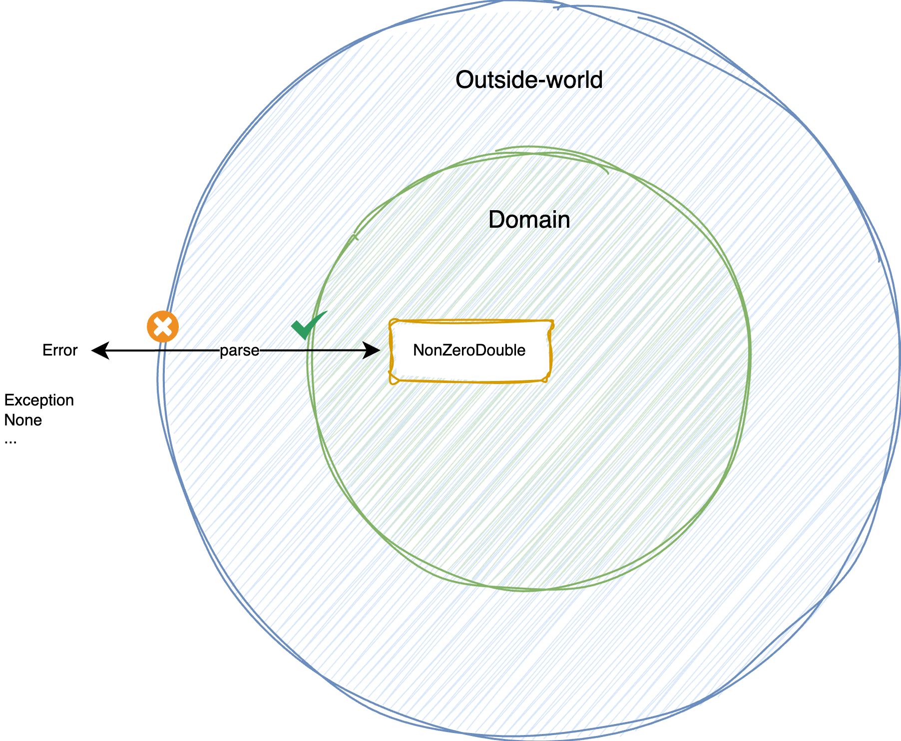

## Day 20: No more exceptions in our domain.

For now, we have only used `Extend the output` by using a `Result` type (like `Option` or `Either`).

Imagine that we work on the method `divide`.

Let's `extend its output` "as usual" to use Option.

> What are the other options?

#### Hollywood principle


> Don't Call Us, We'll Call You

- One of the most popular way to implement this principle is to use `events` or `callbacks`
- The basic idea behind it is `let the caller decide what happens next`

- Let's use callbacks / continuation functions in our `divide` method

- As a consumer / caller of this method we now have to pass callback methods for success and failure
  - The method returns `void` now: `double -> double -> (double -> void) -> (string -> void)` -> void

```java
divide(9, 0,
      result -> out.println("Success: " + result),
      failure -> out.println("Failure: " + failure)
);
```

### Apply `Hollywood Principle` on `Yahtzee`
🔴 Let's adapt a test to design our `Calculator` from Hollywood.

🟢 Make it pass by creating this method from here

- We call the existing method that can still throw an exception

🔵 We create the new methods without `Exception`

- We generate a new method from our production code
- Iterate on the code and we reach a good point
  
Take a look at `domain.yahtzee.hollywood.principle.YahtzeeCalculator` to see the result of this refactoring.

### Constrain the input

It has huge advantages of constraining inputs / arguments:
- You don't need to write preventive code anymore (No more guard clause everywhere)
- We `make it impossible to represent invalid state`
- We have a more business related concepts that are expressed in our code

- Here we express the fact that for dividing a `double` we need to pass a valid double different from 0

- We centralize the construct logic of this kind of data structure through
  - A `Factory Method`
  - A `private constructor`
- We could throw an `Exception` instead of returning an `Option`

> WHAT ??? but the whole point is to not use Exception...

That is the whole point but the idea is to put the logic of `parsing` outside from our `domain` (in our `imperative shell`).



Once, in the domain we can work with any type completely `safely`.

> Now our method expresses explicitly what is accepted as input: `double` -> `NonZeroInteger` -> `double`

### Apply `Constrain Input` on `Yahtzee`

We will use a `Roll` class to do so.

🔴 Let's adapt a first test

🟢 Implement the minimum to pass the test

🔵 We use the `Roll` for calculation

> No defensive programming anymore. Our Dice can only be in a valid state by design.

Take a look at `domain.yahtzee.constrain.input` to see the result of this refactoring.

### Conclusion

> What do you think of those approaches?

- As a side effect, `continuation` has complicated our method signature
- Use this principle with care to avoid callback hell

> Other alternatives exist and can depend on your programming language / paradigm

>**Tip of the day: Removing exceptions from your domain will make it easier to test.**

### Share your experience

How does your code look like?

Please let everyone know in the discord.
