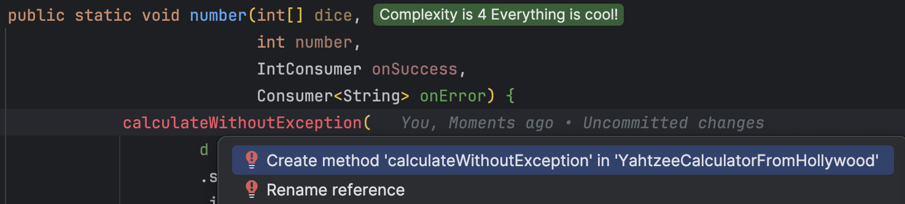
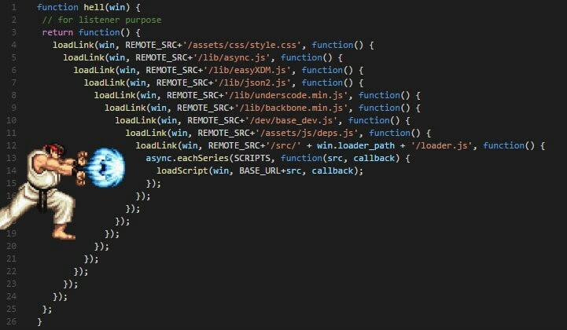

## Day 20: No more exceptions in our domain.
For now, we have only used `Extend the output` by using a `Result` type (like `Option` or `Either`).

Imagine that we work on the method below:

```java
public static double divide(double numerator, double denominator) {
    return numerator / denominator;
}
```

Let's `extend its output` "as usual":

```java
public static Option<Double> divide(double numerator, double denominator) {
    return denominator != 0
            ? some(numerator / denominator)
            : none();
}
```

> What are the other options?

#### Hollywood principle


> Don't Call Us, We'll Call You

- One of the most popular way to implement this principle is to use `events` or `callbacks`
- The basic idea behind it is `let the caller decide what happens next`

- Let's use callbacks / continuation functions in our `divide` method

```java
public static void divide(
        double numerator,
        double denominator,
        Consumer<Double> onSuccess,
        Consumer<String> onError) {
    if (denominator == 0) onError.accept("Invalid denominator");
    else onSuccess.accept(numerator / denominator);
}
```

- As a consumer / caller of this method we now have to pass callback methods for success and failure
  - The method returns `void` now: `double -> double -> (double -> void) -> (string -> void)` -> void

```java
divide(9, 0,
      result -> out.println("Success: " + result),
      failure -> out.println("Failure: " + failure)
);
```

### Apply `Hollywood Principle` on `Yahtzee`
🔴 Let's adapt a test to design our `Calculator` from Hollywood.

```java
@MethodSource("numbers")
@ParameterizedTest
void sum_for_numbers_for(DiceBuilder dice, int number, int expectedResult) {
    number(
            dice.build(),
            number,
            score -> assertThat(score).isEqualTo(expectedResult),
            error -> fail()
    );
}
```

🟢 Make it pass by creating this method from here

- We call the existing method that can still throw an exception

```java
public static void number(int[] dice,
                          int number,
                         IntConsumer onSuccess,
                         Consumer<String> onError) {
    onSuccess.accept(calculate(d -> d.filter(die -> die == number)
                    .sum()
                    .intValue()
            , dice));
}
```

🔵 We create the new methods without `Exception`

- We generate a new method from our production code



- Iterate on the code and we reach that

```java
public static void number(int[] dice,
                          int number,
                          IntConsumer onSuccess,
                          Consumer<String> onError) {
            calculateWithoutException(
                    d -> d.filter(die -> die == number)
                    .sum()
                    .intValue(), dice, onSuccess, onError);
}

private static void calculateWithoutException(Function1<Seq<Integer>, Integer> compute,
                                              int[] dice,
                                              IntConsumer onSuccess,
                                              Consumer<String> onError) {
    validateRollWithoutException(dice, onError);
    onSuccess.accept(
            compute.apply(ofAll(dice))
    );
}

private static void validateRollWithoutException(int[] dice, Consumer<String> onError) {
    if (hasInvalidLength(dice)) {
        onError.accept("Invalid dice... A roll should contain 6 dice.");
    }

    if (containsInvalidDie(dice)) {
        onError.accept("Invalid die value. Each die must be between 1 and 6.");
    }
}
```

Take a look at `domain.yahtzee.hollywood.principle.YahtzeeCalculator` to see the result of this refactoring.

> What are your thoughts about it?

### Constrain the input

It has huge advantages of constraining inputs / arguments:
- You don't need to write preventive code anymore (No more guard clause everywhere)
- We `make it impossible to represent invalid state`
- We have a more business related concepts that are expressed in our code

```java
public static double divide(double numerator, NonZeroDouble denominator) {
    return numerator / denominator.toDouble();
}
```

- Here we express the fact that for dividing a `double` we need to pass a valid double different from 0

```java
public class NonZeroDouble {
    private final double value;

    private NonZeroDouble(double value) {
        this.value = value;
    }

    public static Option<NonZeroDouble> of(double input){
        return input != 0
                ? some(new NonZeroDouble(input))
                : none();
    }

    public double toDouble() {
        return value;
    }
}
```

- We centralize the construct logic of this kind of data structure through
  - A `Factory Method`
  - A `private constructor`
- We could throw an `Exception` instead of returning an `Option`

> WHAT ??? but the whole point is to not use Exception...

That is the whole point but the idea is to put the logic of `parsing` outside from our `domain` (in our `imperative shell`). 


Once, in the domain we can work with any type completely `safely`.

```java
NonZeroDouble.of(0)
        .map(denominator -> divide(9, denominator))
        .map(...)
```

> Now our method expresses explicitly what is accepted as input: `double` -> `NonZeroInteger` -> `double`

### Apply `Constrain Input` on `Yahtzee`

We will use a `Roll` class to do so.

🔴 Let's adapt a first test


The test looks like this

```java
@MethodSource("numbers")
@ParameterizedTest
void sum_for_numbers_for(DiceBuilder dice, int number, int expectedResult) {
    assertThat(
            // Create a roll from primitive types
            Roll.from(dice.build())
                    // call the behavior on the domain if parsing ok
                    .map(r -> number(r, number))
    ).hasRightValueSatisfying(score -> assertThat(score).isEqualTo(expectedResult));
}
```

🟢 Implement the minimum to pass the test

```java
public class Roll {
    private final int[] dice;

    private Roll(int[] dice) {
        this.dice = dice;
    }

    public static Either<Error, Roll> from(int[] dice) {
        return right(new Roll(dice));
    }

    public int[] dice() {
        return this.dice;
    }
}

// In YahtzeeCalculator
public static int number(Roll roll, int number) {
  return calculate(d -> d.filter(die -> die == number)
                  .sum()
                  .intValue()
          , roll.dice());
}
```

🔵 We use the `Roll` for calculation

> No defensive programming anymore. Our Dice can only be in a valid state by design.

```java
public static int number(Roll roll, int number) {
    return calculateWithRoll(r -> r.dice()
                    .filter(die -> die == number)
                    .sum()
                    .intValue()
            , roll);
}

private static int calculateWithRoll(Function1<Roll, Integer> compute, Roll roll) {
    return compute.apply(roll);
}
```

At the end, our calculator looks like this:


And here is the `Roll` class

```java
public class Roll {
    private static final int ROLL_LENGTH = 5;
    private static final int MINIMUM_DIE = 1;
    private static final int MAXIMUM_DIE = 6;

    private final Seq<Integer> dice;

    private Roll(int[] dice) {
        this.dice = ofAll(dice);
    }

    public static Either<Error, Roll> from(int[] dice) {
        if (hasInvalidLength(dice)) {
            return left(error("Invalid dice... A roll should contain 6 dice."));
        }
        if (containsInvalidDie(dice)) {
            return left(error("Invalid die value. Each die must be between 1 and 6."));
        }
        return right(new Roll(dice));
    }

    private static boolean hasInvalidLength(int[] dice) {
        return dice == null || dice.length != ROLL_LENGTH;
    }

    private static boolean containsInvalidDie(int[] dice) {
        return ofAll(dice).exists(Roll::isValidDie);
    }

    private static boolean isValidDie(int die) {
        return die < MINIMUM_DIE || die > MAXIMUM_DIE;
    }

    public Map<Integer, Integer> groupDieByFrequency() {
        return dice.groupBy(x -> x)
                .mapValues(Traversable::length);
    }

    @Override
    public String toString() {
        return dice.sorted()
                .distinct()
                .mkString();
    }

    public Seq<Integer> dice() {
        return this.dice;
    }
}
```

Take a look at `domain.yahtzee.constrain.input` to see the result of this refactoring.

### Conclusion

> What do you think of those approaches?

- As a side effect, `continuation` has complicated our method signature
- Use this principle with care to avoid callback hell



> Other alternatives exist and can depend on your programming language / paradigm