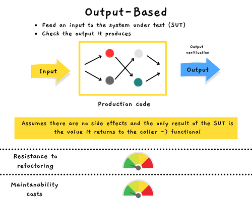
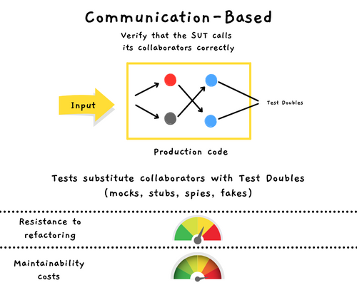
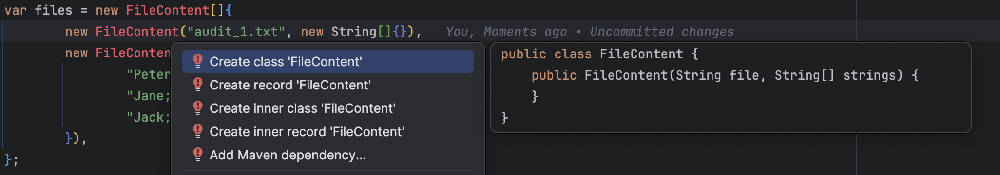

## Day 21: Refactor the tests and production code to Output-Based tests.
Before refactoring the code, here are some explanations regarding the different kind of tests as explained by Vladimir Khorikov in his book [Unit Testing Principles, Practices and Patterns.](https://www.manning.com/books/unit-testing).

### Different styles of tests
#### State-Based

```java
class StateBasedTests {
    @Test
    void it_should_add_given_product_to_the_order() {
        val product = new Product("Free Guy");
        val sut = new Order();

        sut.add(product);

        // Verify the state
        assertThat(sut.getProducts())
                .hasSize(1)
                .allMatch(item -> item.equals(product));
    }

    @AllArgsConstructor
    class Product {
        private final String name;
    }

    class Order {
        private final List<Product> products = new ArrayList<>();

        List<Product> getProducts() {
            return Collections.unmodifiableList(products);
        }

        void add(Product product) {
            products.add(product);
        }
    }
}
```


#### Output-Based

```java
class OutputBasedTests {
    @Test
    void discount_of_2_products_should_be_2_percent() {
        val product1 = new Product("Kaamelott");
        val product2 = new Product("Free Guy");

        // Call on the SUT (here PriceEngine)
        // No side effects -> Pure function
        val discount = PriceEngine.calculateDiscount(product1, product2);

        assertThat(discount).isEqualTo(0.02);
    }
}
```



#### Communication-Based

```java
class CommunicationBasedTests {
    @Test
    void greet_a_user_should_send_an_email_to_it() {
        final var email = "john.doe@email.com";
        final var emailGatewayMock = mock(EmailGateway.class);
        // Substitute collaborators with Test Double
        final var sut = new Controller(emailGatewayMock);

        sut.greetUser(email);

        // Verify that the SUT calls those collaborators correctly
        verify(emailGatewayMock, times(1)).sendGreetingsEmail(email);
    }

    interface EmailGateway {
        Try<String> sendGreetingsEmail(String email);
    }

    @AllArgsConstructor
    class Controller {
        private final EmailGateway emailGateway;

        public Try<String> greetUser(String email) {
            return emailGateway.sendGreetingsEmail(email);
        }
    }
}
```



### Refactor to Output-Based
- Instead of hiding side effects behind an interface and injecting that interface into `AuditManager`, we can move those side effects out of the class entirely :
  - `AuditManager`: responsible for making a decision about what to do with the files
  - A new class, `Persister` acts on that decision and applies updates to the filesystem

```java
public class AuditManager {
    private final int maxEntriesPerFile;
    private final String directoryName;
    private final FileSystem fileSystem;

    public AuditManager(int maxEntriesPerFile, String directoryName, FileSystem fileSystem) {
        this.maxEntriesPerFile = maxEntriesPerFile;
        this.directoryName = directoryName;
        this.fileSystem = fileSystem;
    }

    public void addRecord(String visitorName, LocalDateTime timeOfVisit) {
        String[] filePaths = fileSystem.getFiles(directoryName);
        String[] sorted = sortByIndex(filePaths);
        DateTimeFormatter dateTimeFormatter = DateTimeFormatter.ofPattern("yyyy-MM-dd HH:mm:ss");
        String newRecord = visitorName + ";" + timeOfVisit.format(dateTimeFormatter);

        if (sorted.length == 0) {
            String newFile = Paths.get(directoryName, "audit_1.txt").toString();
            fileSystem.writeAllText(newFile, newRecord);
            return;
        }

        int currentFileIndex = sorted.length - 1;
        String currentFilePath = sorted[currentFileIndex];
        List<String> lines = fileSystem.readAllLines(currentFilePath);

        if (lines.size() < maxEntriesPerFile) {
            lines.add(newRecord);
            String newContent = String.join(System.lineSeparator(), lines);
            fileSystem.writeAllText(currentFilePath, newContent);
        } else {
            String newName = "audit_" + (currentFileIndex + 2) + ".txt";
            String newFile = Paths.get(directoryName, newName).toString();
            fileSystem.writeAllText(newFile, newRecord);
        }
    }

    private String[] sortByIndex(String[] filePaths) {
        return Arrays.stream(filePaths)
                .sorted()
                .toArray(String[]::new);
    }
}
```

From what is above to this diagram :


#### AuditManager
In terms of contract we would like something like this: 
- `FileUpdate addRecord(FileContent[] files, String visitorName, LocalDateTime timeOfVisit)`
- We choose to write the code `from scratch` aside from existing code
  - When we do it on legacy code, it's called [`Sprout Class`](https://understandlegacycode.com/blog/key-points-of-working-effectively-with-legacy-code/#1-the-sprout-technique)

🔴 Let's express this expectation from a test

```java
@Test
void addsNewVisitorToANewFileWhenEndOfLastFileIsReached() {
    // Arrange
    var files = new FileContent[]{
            new FileContent("audit_1.txt", new String[]{}),
            new FileContent("audit_2.txt", new String[]{
                    "Peter;2019-04-06 16:30:00",
                    "Jane;2019-04-06 16:40:00",
                    "Jack;2019-04-06 17:00:00"
            }),
    };
    var auditManager = new AuditManager(3);

    // Act
    var fileUpdate = auditManager.addRecord(files, "Alice", LocalDateTime.parse("2019-04-06T18:00:00"));

    // Assert
    assertThat(fileUpdate).isEqualTo(new FileUpdate("audit_3.txt", "Alice;2019-04-06 18:00:00"));
}
```

- Of course, we do not compile here...
  - We have just prototyped a first version of what we might want (it can evolve while writing the code)


- We generate the classes from our test



- Here is the generated skeleton

```java
public class AuditManager {
    public AuditManager(int maxEntriesPerFile) {

    }

    public FileUpdate addRecord(FileContent[] files, String visitorName, LocalDateTime timeOfVisit) {
        return null;
    }
}

public record FileContent(String fileName, String[] lines) {
}

public record FileUpdate(String fileName, String newContent) {
}
```

🔴 The test is still red but for a good reason: because of the assertion (no compilation error anymore)

🟢 Make it pass as fast as possible

- We hard code the value for now
  - We can check that our flow is correct

```java
public class AuditManager {
    public AuditManager(int maxEntriesPerFile) {

    }

    public FileUpdate addRecord(FileContent[] files, String visitorName, LocalDateTime timeOfVisit) {
        return new FileUpdate("audit_3.txt", "Alice;2019-04-06 18:00:00");
    }
}
```

🔵 Let's refactor it

- Based on the existing logic we would like to design something that looks like this:
  - sortFiles -> formatDate -> createRecord -> createFileUpdate (based on maxEntriesPerFile)
- We will iterate on the code

```java
public FileUpdate addRecord(FileContent[] files, String visitorName, LocalDateTime timeOfVisit) {
    // sortFiles
    var sorted = sortByIndex(files);
    // formatDate
    var dateTimeFormatter = DateTimeFormatter.ofPattern("yyyy-MM-dd HH:mm:ss");
    // createRecord
    var newRecord = visitorName + ";" + timeOfVisit.format(dateTimeFormatter);

    // createFileUpdate (based on maxEntriesPerFile)
    return new FileUpdate("audit_3.txt", newRecord);
}

private FileContent[] sortByIndex(FileContent[] files) {
    return null;
}
```

- Our test is still green, so let's move on

```java
public FileUpdate addRecord(FileContent[] files, String visitorName, LocalDateTime timeOfVisit) {
    var sorted = sortByIndex(files);
    var dateTimeFormatter = DateTimeFormatter.ofPattern("yyyy-MM-dd HH:mm:ss");
    var newRecord = visitorName + ";" + timeOfVisit.format(dateTimeFormatter);

    var currentFile = sorted.getLast();
    var currentFileIndex = sorted.size();

    var newFileIndex = currentFileIndex + 1;
    var newFileName = "audit_" + newFileIndex + ".txt";

    return new FileUpdate(newFileName, newRecord);
}

private List<FileContent> sortByIndex(FileContent[] files) {
    return stream(files)
            .sorted(comparing(FileContent::fileName))
            .toList();
}
```

- We improved the algorithm
- Other tests are missing to `triangulate` the rest of the implementation
  - Let's add them incrementally

```java
@Test
void addsNewVisitorToANewFileBecauseNoFileToday() {
    var files = new FileContent[]{};
    var auditManager = new AuditManager(3);

    var fileUpdate = auditManager.addRecord(files, "Alice", parse("2019-04-06T18:00:00"));

    assertThat(fileUpdate)
            .isEqualTo(new FileUpdate("audit_1.txt", "Alice;2019-04-06 18:00:00"));
}
```

> It is the same logic here for this test case

- We refactor the tests before adding a new test case

```java
class AuditManagerOutputBasedTests {
  private static final FileContent[] NO_FILES = {};
  private static final LocalDateTime TIME_OF_VISIT = parse("2019-04-06T18:00:00");
  public static final String NEW_CONTENT = "Alice;2019-04-06 18:00:00";
  public static final String VISITOR = "Alice";
  private AuditManager auditManager;

  @BeforeEach
  void setup() {
    auditManager = new AuditManager(3);
  }

  @Test
  void addsNewVisitorToANewFileBecauseNoFileToday() {
    assertThat(addRecord(NO_FILES))
            .isEqualTo(new FileUpdate("audit_1.txt", NEW_CONTENT));
  }

  @Test
  void addsNewVisitorToANewFileWhenEndOfLastFileIsReached() {
    var files = new FileContent[]{
            new FileContent("audit_1.txt", new String[]{}),
            new FileContent("audit_2.txt", new String[]{
                    "Peter;2019-04-06 16:30:00",
                    "Jane;2019-04-06 16:40:00",
                    "Jack;2019-04-06 17:00:00"
            }),
    };

    assertThat(addRecord(files))
            .isEqualTo(new FileUpdate("audit_3.txt", NEW_CONTENT));
  }

  private FileUpdate addRecord(FileContent[] files) {
    return auditManager.addRecord(files, VISITOR, TIME_OF_VISIT);
  }
}
```

🔴 Let's add a test that writes in the `Current Audit File`

```java
@Test
void addsNewVisitorToAnExistingFile() {
    var files = new FileContent[]{
            new FileContent("audit_1.txt", new String[]{}),
            new FileContent("audit_2.txt", new String[]{
                    "Peter;2019-04-06 16:30:00"
            }),
    };

    assertThat(addRecord(files))
            .isEqualTo(new FileUpdate("audit_2.txt",
                    "Peter;2019-04-06 16:30:00" + System.lineSeparator() +
                            NEW_CONTENT
            ));
}
```

- Of course, we need to triangulate our algorithm with this test


🟢 Iterate on the `addRecord` method

```java
public FileUpdate addRecord(FileContent[] files, String visitorName, LocalDateTime timeOfVisit) {
    var sorted = sortByIndex(files);
    var dateTimeFormatter = DateTimeFormatter.ofPattern("yyyy-MM-dd HH:mm:ss");
    var newRecord = visitorName + ";" + timeOfVisit.format(dateTimeFormatter);

    var currentFileIndex = sorted.size();
    var newFileIndex = currentFileIndex + 1;
    var newFileName = "audit_" + newFileIndex + ".txt";

    var currentFile = sorted.getLast();

    if (stream(currentFile.lines()).count() < maxEntriesPerFile) {
        var lines = new ArrayList<>(stream(currentFile.lines()).toList());
        lines.add(newRecord);
        var newContent = lines.stream().collect(Collectors.joining(System.lineSeparator()));

        return new FileUpdate(currentFile.fileName(), newContent);
    }

    return new FileUpdate(newFileName, newRecord);
}
```

🔴 By incrementing on the code, we have broken a test `addsNewVisitorToANewFileBecauseNoFileToday`

- We fix it as fast as possible to go back in a safe state

```java
public FileUpdate addRecord(FileContent[] files, String visitorName, LocalDateTime timeOfVisit) {
    var sorted = sortByIndex(files);
    var dateTimeFormatter = DateTimeFormatter.ofPattern("yyyy-MM-dd HH:mm:ss");
    var newRecord = visitorName + ";" + timeOfVisit.format(dateTimeFormatter);

    if (sorted.isEmpty()) {
        return new FileUpdate("audit_1.txt", newRecord);
    }

    var currentFileIndex = sorted.size();
    var newFileIndex = currentFileIndex + 1;
    var newFileName = "audit_" + newFileIndex + ".txt";

    var currentFile = sorted.getLast();

    if (stream(currentFile.lines()).count() < maxEntriesPerFile) {
        var lines = new ArrayList<>(stream(currentFile.lines()).toList());
        lines.add(newRecord);
        var newContent = lines.stream().collect(Collectors.joining(System.lineSeparator()));

        return new FileUpdate(currentFile.fileName(), newContent);
    }

    return new FileUpdate(newFileName, newRecord);
}
```

🔵 It's time to play 🥳

- We extract some methods and rename some variables

```java
public FileUpdate addRecord(FileContent[] files, String visitorName, LocalDateTime timeOfVisit) {
    var sortedFiles = sortByIndex(files);
    var newRecord = createNewRecord(visitorName, timeOfVisit);

    return (sortedFiles.isEmpty())
            ? new FileUpdate("audit_1.txt", newRecord)
            : createNewFileOrUpdate(sortedFiles, newRecord);
}

private List<FileContent> sortByIndex(FileContent[] files) {
    return stream(files)
            .sorted(comparing(FileContent::fileName))
            .toList();
}

private static String createNewRecord(String visitorName, LocalDateTime timeOfVisit) {
    return visitorName + ";" + timeOfVisit.format(DATE_TIME_FORMATTER);
}

private FileUpdate createNewFileOrUpdate(List<FileContent> sortedFiles, String newRecord) {
    var currentFileIndex = sortedFiles.size();
    var newFileIndex = currentFileIndex + 1;
    var newFileName = "audit_" + newFileIndex + ".txt";

    var currentFile = sortedFiles.getLast();

    if (stream(currentFile.lines()).count() < maxEntriesPerFile) {
        var lines = new ArrayList<>(stream(currentFile.lines()).toList());
        lines.add(newRecord);
        var newContent = lines.stream().collect(Collectors.joining(System.lineSeparator()));

        return new FileUpdate(currentFile.fileName(), newContent);
    }
    return new FileUpdate(newFileName, newRecord);
}
```

- We can definitely improve the `createNewFileOrUpdate` method


```java
public class AuditManager {
    public static final DateTimeFormatter DATE_TIME_FORMATTER = DateTimeFormatter.ofPattern("yyyy-MM-dd HH:mm:ss");
    public static final String AUDIT = "audit_";
    private final int maxEntriesPerFile;

    public AuditManager(int maxEntriesPerFile) {
        this.maxEntriesPerFile = maxEntriesPerFile;
    }

    public FileUpdate addRecord(FileContent[] files, String visitorName, LocalDateTime timeOfVisit) {
        var sortedFiles = sortByIndex(files);
        var newRecord = createNewRecord(visitorName, timeOfVisit);

        return (sortedFiles.isEmpty())
                ? createANewFile(sortedFiles, newRecord)
                : createNewFileOrUpdate(sortedFiles, newRecord);
    }

    private static FileUpdate createANewFile(List<FileContent> sortedFiles, String newRecord) {
        var currentFileIndex = sortedFiles.size();
        var newFileName = createAuditFileName(currentFileIndex + 1);

        return new FileUpdate(newFileName, newRecord);
    }

    private FileUpdate createNewFileOrUpdate(List<FileContent> sortedFiles, String newRecord) {
        var currentFile = sortedFiles.getLast();

        return canAppendToExistingFile(currentFile)
                ? appendToExistingFile(newRecord, currentFile)
                : createANewFile(sortedFiles, newRecord);
    }

    private List<FileContent> sortByIndex(FileContent[] files) {
        return stream(files)
                .sorted(comparing(FileContent::fileName))
                .toList();
    }

    private static String createNewRecord(String visitorName, LocalDateTime timeOfVisit) {
        return visitorName + ";" + timeOfVisit.format(DATE_TIME_FORMATTER);
    }

    private static String createAuditFileName(int index) {
        return AUDIT + index + ".txt";
    }

    private static FileUpdate appendToExistingFile(String newRecord, FileContent currentFile) {
        var lines = new ArrayList<>(currentFile.lines());
        lines.add(newRecord);
        var newContent = lines.stream().collect(Collectors.joining(System.lineSeparator()));

        return new FileUpdate(currentFile.fileName(), newContent);
    }

    private boolean canAppendToExistingFile(FileContent currentFile) {
        return currentFile.lines().size() < maxEntriesPerFile;
    }
}
```

- Here are the tests

```java
class AuditManagerShould {
    private static final FileContent[] NO_FILES = {};
    private static final LocalDateTime TIME_OF_VISIT = parse("2019-04-06T18:00:00");
    public static final String NEW_CONTENT = "Alice;2019-04-06 18:00:00";
    public static final String VISITOR = "Alice";
    public static final ArrayList<String> NO_CONTENT = new ArrayList<>();
    private AuditManager auditManager;

    @BeforeEach
    void setup() {
        auditManager = new AuditManager(3);
    }

    @Test
    void add_new_visitor_to_a_new_file_because_no_file_today() {
        assertThat(addRecord(NO_FILES))
                .isEqualTo(new FileUpdate("audit_1.txt", NEW_CONTENT));
    }

    @Test
    void add_new_visitor_to_an_existing_file() {
        var files = files(
                fileContent("audit_1.txt", NO_CONTENT),
                fileContent("audit_2.txt", contentFrom("Peter;2019-04-06 16:30:00"))
        );

        assertThat(addRecord(files))
                .isEqualTo(new FileUpdate("audit_2.txt",
                        "Peter;2019-04-06 16:30:00" + System.lineSeparator() +
                                NEW_CONTENT
                ));
    }

    @Test
    void add_new_visitor_to_a_new_file_when_end_of_last_file_is_reached() {
        var files = files(
                fileContent("audit_1.txt", NO_CONTENT),
                fileContent("audit_2.txt",
                        contentFrom(
                                "Peter;2019-04-06 16:30:00",
                                "Jane;2019-04-06 16:40:00",
                                "Jack;2019-04-06 17:00:00"
                        )

                )
        );

        assertThat(addRecord(files))
                .isEqualTo(new FileUpdate("audit_3.txt", NEW_CONTENT));
    }

    private FileUpdate addRecord(FileContent[] files) {
        return auditManager.addRecord(files, VISITOR, TIME_OF_VISIT);
    }

    private static FileContent[] files(FileContent... files) {
        return files;
    }

    private static FileContent fileContent(String fileName, ArrayList<String> lines) {
        return new FileContent(fileName, lines);
    }

    private static ArrayList<String> contentFrom(String... lines) {
        return new ArrayList<>(Arrays.stream(lines).toList());
    }
}
```

- We have lost some features in the battle 
  - Let's implement the `Persister` class

#### Persister - Bonus
The Persister is responsible for
- accessing files from a given Directory
- applying update instruction (a.k.a update the file content)

```java
public class Persister {
    public FileContent[] readDirectory(String directory) throws IOException {
        return Files.walk(Paths.get(directory))
                .filter(Files::isRegularFile)
                .map(Persister::readFile)
                .toArray(FileContent[]::new);
    }

    public void applyUpdate(String directory, FileUpdate update) throws IOException {
        Files.writeString(Path.of(directory, update.fileName()), update.newContent());
    }

    private static FileContent readFile(Path f) {
        try {
            return new FileContent(f.getFileName().toString(), new ArrayList<>(Files.readAllLines(f)));
        } catch (IOException e) {
            throw new RuntimeException(e);
        }
    }
}
```

#### AddRecordUseCase
We need to have some glue to control the flow of our application. Let's create a `UseCase` for that :

```java
public class AddRecordUseCase {
    private final String directory;
    private final AuditManager auditManager;
    private final Persister persister;

    // Should come from configuration
    public AddRecordUseCase(String directory, AuditManager auditManager, Persister persister) {
        this.directory = directory;
        this.auditManager = auditManager;
        this.persister = persister;
    }

    public void handle(AddNewVisitor addNewVisitor) throws IOException {
        var files = persister.readDirectory(directory);
        // Call the functional core (no side effect here)
        var update = auditManager.addRecord(files, addNewVisitor.visitor(), addNewVisitor.time());
        
        persister.applyUpdate(directory, update);
    }
}

public record AddNewVisitor(String visitor, LocalDateTime time) { }
```