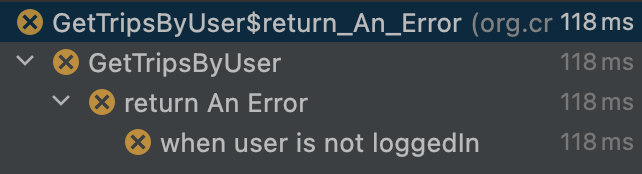
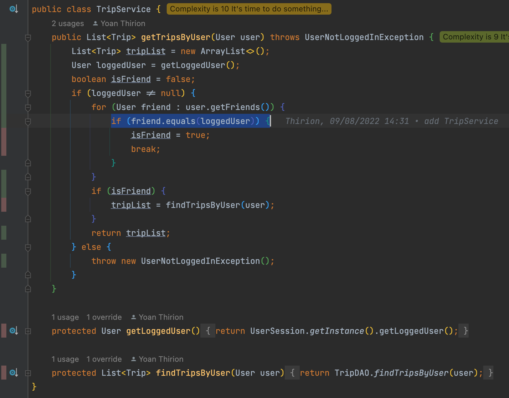
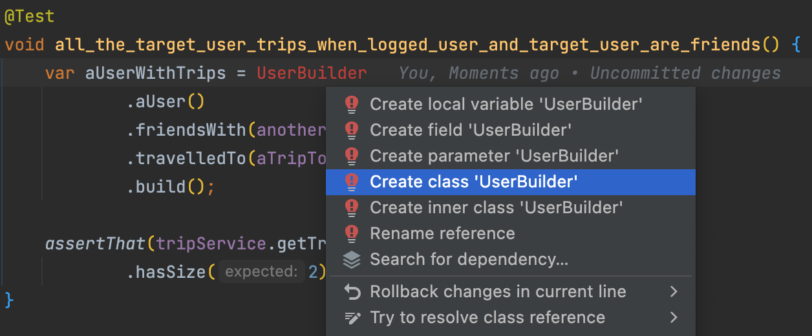

## Cover our code
- Identify code smells in the `TripService` class

```java
public class TripService {
    // Too many responsibilities
    // Hidden dependencies : Session / DAO
	public List<Trip> getTripsByUser(User user) throws UserNotLoggedInException {
		List<Trip> tripList = new ArrayList<>();
        // Use of static method 
		User loggedUser = UserSession.getInstance().getLoggedUser();
		boolean isFriend = false;
        
        // Cyclomatic Complexity too high
		if (loggedUser != null) {
            // What is the logic here ?
            // Why this logic is not encapsulated inside the `User` class
			for (User friend : user.getFriends()) {
				if (friend.equals(loggedUser)) {
					isFriend = true;
					break;
				}
			}
			if (isFriend) {
                // Use of static method 
				tripList = TripDAO.findTripsByUser(user);
			}
			return tripList;
		} else {
            // Maybe there is a better way to handle this case?
			throw new UserNotLoggedInException();
		}
	}
	
}
```

### Write a first test (naively)
🔴 We have a first red test

```java
// Helps to have more readable test names
@DisplayNameGeneration(ReplaceUnderscores.class)
class GetTripsByUser {
    // Nested classes can be used to isolate passing and passing test cases
    @Nested
    class return_An_Error { // Is it a good name regarding our business?
        @Test
        void when_user_is_not_loggedIn() {
            var tripService = new TripService();
            assertThatThrownBy(() -> tripService.getTripsByUser(new User()))
                    .isInstanceOf(UserNotLoggedInException.class);
        }
    }
}
```



- Here we have a problem
	- The exception thrown is not the expected one : `Expecting actual throwable to be an instance of: UserNotLoggedInException but was: CollaboratorCallException`
	- This exception is thrown by a hidden collaborator : `UserSession`
- We will have the same problem with the other hidden dependencies

By the way this test class is not respecting the default surefire test pattern: `**Test**`. We had to adapt the configuration like this:
```xml
<plugin>
    <groupId>org.apache.maven.plugins</groupId>
    <artifactId>maven-surefire-plugin</artifactId>
    <version>${maven.surefire.version}</version>
    <configuration>
        <includes>
            <include>%regex[.*Should.*]</include>
        </includes>
    </configuration>
</plugin>
```

> How could we make this code testable?

### Seams
- Adding tests on the existing code can be challenging
- The code was not written to be testable in the first place
- `99%` of the time, this is a dependency problem
- 	The code you want to test can’t run
	- It needs something hard to put in the test :
		- A database connection 
		- A third-party server
		- A parameter that’s complex to instantiate
	- Usually, it’s a complex mix of all that.

> To test your code, you need to break these dependencies in the tests.

Therefore, you need to identify `Seams`.

`A Seam is a place to alter program behavior, without changing the code.`

There are different types of Seams. 
The gist of it is to identify how you can change the code behavior without touching the source code.

If your language is Object-Oriented, the most common and convenient Seam is an object.

Consider this piece of JavaScript code :

```js
export class DatabaseConnector {
  // A lot of code…

  connect() {
    // Perform some calls to connect to the DB.
  }
}
```

Say the connect() method is causing you problems when you try to put code into tests. Well, the `whole class is a Seam you can alter`.

You can extend this class in tests to prevent it from connecting to an actual DB:

```js
class FakeDatabaseConnector extends DatabaseConnector {
  connect() {
    // Override the problematic calls to the DB
    console.log("Connect to the DB")
  }
}
```

### Isolate the Singleton dependencies
- Isolate the Singleton dependencies in their own method

```java
UserSession.getInstance().getLoggedUser();
TripDAO.findTripsByUser(user);
```

- Do it through automated `extract method` refactoring

```java
public class TripService {
    public List<Trip> getTripsByUser(User user) throws UserNotLoggedInException {
        ...
        User loggedUser = getLoggedUser();
        ...
            if (isFriend) {
                tripList = findTripsByUser(user);
            }
        ...
    }

    // Here are our 2 seams
    private User getLoggedUser() {
        return UserSession.getInstance().getLoggedUser();
    }

    private List<Trip> findTripsByUser(User user) {
        return TripDAO.findTripsByUser(user);
    }
}
```

### Fix our first test
- In our test class, we can now extend the `TripService` class -> 'Seam' class
- We can now override the `private` to `protected` methods we created making them return whatever we need for our unit tests

```java
private class SeamTripService extends TripService {
    @Override
    protected User getLoggedUser() {
        return null;
    }

    @Override
    protected List<Trip> findTripsByUser(User user) {
        return user.trips();
    }
}
```

🟢 Adapt the test to use the `SeamTripService`

```java
@DisplayNameGeneration(ReplaceUnderscores.class)
class GetTripsByUser {
    @Nested
    class return_An_Error {
        @Test
        void when_user_is_not_loggedIn() {
            var tripService = new SeamTripService();
            assertThatThrownBy(() -> tripService.getTripsByUser(new User()))
                    .isInstanceOf(UserNotLoggedInException.class);
        }
    }

    private class SeamTripService extends TripService {
        @Override
        protected User getLoggedUser() {
            return null;
        }

        @Override
        protected List<Trip> findTripsByUser(User user) {
            return user.trips();
        }
    }
}
```

🔵 Let's improve our test
- Avoid to use not named `stuff`
- Centralize instantiation of the `Service` in a factory method

```java
@DisplayNameGeneration(ReplaceUnderscores.class)
class GetTripsByUser {
    private final User guest = null;
    private final User targetUser = new User();
    private final TripService tripService = createTripService();

    @Nested
    class return_An_Error {
        @Test
        void when_user_is_not_loggedIn() {
            var tripService = createTripService();
            assertThatThrownBy(() -> tripService.getTripsByUser(targetUser))
                    .isInstanceOf(UserNotLoggedInException.class);
        }
    }

    private TripService createTripService() {
        return new SeamTripService();
    }

    private class SeamTripService extends TripService {
        @Override
        protected User getLoggedUser() {
            return guest;
        }

        @Override
        protected List<Trip> findTripsByUser(User user) {
            return user.trips();
        }
    }
}
```

### Coverage as a Driver
- Run your favorite `code coverage` tool
- Use the result as a driver for implementing/writing new tests


- `From shortest to deepest branch`, what is our next test to write ?

🔴 Let's write it
```java
@Nested
class return_ {
    @Test
    void no_trips_when_logged_user_is_not_a_friend_of_the_target_user() {
        assertThat(tripService.getTripsByUser(targetUser))
                .isEmpty();
    }
}
```

🟢 We need to adapt a bit the `getLoggedUser` from our seam
- Change the implementation of the method by returning the `loggeduser`

```java
@DisplayNameGeneration(ReplaceUnderscores.class)
class GetTripsByUser {
    private final User registeredUser = new User();
    private final User guest = null;
    private final User targetUser = new User();
    private final TripService tripService = createTripService();
    private User loggedUser = registeredUser;

    @Nested
    class return_An_Error {
        @Test
        void when_user_is_not_loggedIn() {
            loggedUser = guest;
            assertThatThrownBy(() -> tripService.getTripsByUser(targetUser))
                    .isInstanceOf(UserNotLoggedInException.class);
        }
    }

    @Nested
    class return_ {
        @Test
        void no_trips_when_logged_user_is_not_a_friend_of_the_target_user() {
            assertThat(tripService.getTripsByUser(targetUser))
                    .isEmpty();
        }
    }

    private TripService createTripService() {
        return new SeamTripService();
    }

    private class SeamTripService extends TripService {
        @Override
        protected User getLoggedUser() {
            return loggedUser;
        }

        @Override
        protected List<Trip> findTripsByUser(User user) {
            return user.trips();
        }
    }
}
```

🔵 What can be improved?

- Make the setup of our fields more explicit -> use `@BeforeEach`
- Create setup method `notLoggedUser`

```java
class GetTripsByUser {
    private final User registeredUser = new User();
    private final User targetUser = new User();
    private TripService tripService;
    private User loggedUser;

    @BeforeEach
    void setup() {
        loggedUser = registeredUser;
        tripService = createTripService();
    }

    @Nested
    class return_An_Error {
        private final User guest = null;
        
        @Test
        void when_user_is_not_loggedIn() {
            notLoggedUser();
            assertThatThrownBy(() -> tripService.getTripsByUser(targetUser))
                    .isInstanceOf(UserNotLoggedInException.class);
        }

        private void notLoggedUser() {
            loggedUser = guest;
        }
    }
```

- We have improved our coverage


- BUT do we do enough in our last test ?
  - The user on which we ask for trips does not contain any trips nor any friends...
  - `we can not be sure our feature is implemented well`
  - We need to improve our test setup

```java
@Test
void no_trips_when_logged_user_is_not_a_friend_of_the_target_user() {
    var aUserWithTrips = new User();
    aUserWithTrips.addTrip(new Trip());
    aUserWithTrips.addFriend(new User());

    assertThat(tripService.getTripsByUser(aUserWithTrips))
            .isEmpty();
}
```

🔵 We clean up a little the code as well
- Once again, avoid having named values like `null` or `new Trip()` in your tests
- Give business sense to those by naming them

```java
@Nested
class return_ {
    private final Trip aTripToLisbon = new Trip();
    private final User anotherUser = new User();

    @Test
    void no_trips_when_logged_user_is_not_a_friend_of_the_target_user() {
        var aUserWithTrips = new User();
        aUserWithTrips.addTrip(aTripToLisbon);
        aUserWithTrips.addFriend(anotherUser);

        assertThat(tripService.getTripsByUser(aUserWithTrips))
                .isEmpty();
    }
}
```



🟢 Let's cover the `happy path` now

```java
@Test
void all_the_target_user_trips_when_logged_user_and_target_user_are_friends() {
    var aUserWithTrips = new User();
    aUserWithTrips.addTrip(aTripToLisbon);
    aUserWithTrips.addTrip(aTripToSpringfield);
    aUserWithTrips.addFriend(anotherUser);
    aUserWithTrips.addFriend(loggedUser);

    assertThat(tripService.getTripsByUser(aUserWithTrips))
            .hasSize(2)
            .contains(aTripToLisbon, aTripToSpringfield);
}
```

Here is the impact on the code coverage


### What can be improved ?
```java
@DisplayNameGeneration(ReplaceUnderscores.class)
class GetTripsByUser {
    private final User registeredUser = new User();
    private TripService tripService;
    private User loggedUser;

    @BeforeEach
    void setup() {
        loggedUser = registeredUser;
        tripService = createTripService();
    }

    @Nested
    class return_An_Error {
        private final User guest = null;

        @Test
        void when_user_is_not_loggedIn() {
            notLoggedUser();
            assertThatThrownBy(() -> tripService.getTripsByUser(guest))
                    .isInstanceOf(UserNotLoggedInException.class);
        }

        private void notLoggedUser() {
            loggedUser = guest;
        }
    }

    @Nested
    class return_ {
        private final Trip aTripToLisbon = new Trip();
        private final Trip aTripToSpringfield = new Trip();
        private final User anotherUser = new User();

        @Test
        void no_trips_when_logged_user_is_not_a_friend_of_the_target_user() {
            var aUserWithTrips = new User();
            aUserWithTrips.addTrip(aTripToLisbon);
            aUserWithTrips.addFriend(anotherUser);

            assertThat(tripService.getTripsByUser(aUserWithTrips))
                    .isEmpty();
        }

        @Test
        void all_the_target_user_trips_when_logged_user_and_target_user_are_friends() {
            var aUserWithTrips = new User();
            aUserWithTrips.addTrip(aTripToLisbon);
            aUserWithTrips.addTrip(aTripToSpringfield);
            aUserWithTrips.addFriend(anotherUser);
            aUserWithTrips.addFriend(loggedUser);

            assertThat(tripService.getTripsByUser(aUserWithTrips))
                    .hasSize(2)
                    .contains(aTripToLisbon, aTripToSpringfield);
        }
    }

    private TripService createTripService() {
        return new SeamTripService();
    }

    private class SeamTripService extends TripService {
        @Override
        protected User getLoggedUser() {
            return loggedUser;
        }

        @Override
        protected List<Trip> findTripsByUser(User user) {
            return user.trips();
        }
    }
}
```

- We have some duplications in our tests
  - And some test setups already require some cognitive resources to understand what is going on :
```java
var aUserWithTrips = new User();
aUserWithTrips.addTrip(aTripToLisbon);
aUserWithTrips.addTrip(aTripToSpringfield);
aUserWithTrips.addFriend(anotherUser);
aUserWithTrips.addFriend(loggedUser);
```

> What is the impact on our tests if the User constructor changes? 

#### Use Test Data Builders
🔵 [Test Data Builders](https://xtrem-tdd.netlify.app/Flavours/test-data-builders) can help you when writing / maintaining unit tests:
- It helps to hide / encapsulate / centralize the creation of your objects
  - Make it more flexible if your design changes
- Make your tests more readable and more business oriented

> "It eliminates the irrelevant, and amplifies the essentials of the test."

- Define your builder from your IDE
  - Type it directly in your test
  - Generate the code from usage

```java
var aUserWithTrips = UserBuilder
    .aUser()
    .friendsWith(anotherUser, loggedUser)
    .travelledTo(aTripToLisbon, aTripToSpringfield)
    .build();
```
- Now let our IDE generates the code for us



```java
public class UserBuilder {
    public static UserBuilder aUser() {
        return new UserBuilder();
    }

    public UserBuilder friendsWith(User... friends) {
        return this;
    }

    public UserBuilder travelledTo(Trip... trips) {
        return this;
    }

    public User build() {
        return new User();
    }
}
```

- Then implement it

```java
public class UserBuilder {
    private User[] friends = new User[0];
    private Trip[] trips = new Trip[0];

    public static UserBuilder aUser() {
        return new UserBuilder();
    }

    public UserBuilder friendsWith(User... friends) {
        this.friends = friends;
        return this;
    }

    public UserBuilder travelledTo(Trip... trips) {
        this.trips = trips;
        return this;
    }

    public User build() {
        var user = new User();
        stream(friends).forEach(user::addFriend);
        stream(trips).forEach(user::addTrip);

        return user;
    }
}
```

- Use the `Builder in all the tests`
```java
@DisplayNameGeneration(ReplaceUnderscores.class)
class GetTripsByUser {
    private final User registeredUser = aUser().build();
    private TripService tripService;
    private User loggedUser;

    @BeforeEach
    void setup() {
        loggedUser = registeredUser;
        tripService = createTripService();
    }

    @Nested
    class return_An_Error {
        private final User guest = null;

        @Test
        void when_user_is_not_loggedIn() {
            notLoggedUser();
            assertThatThrownBy(() -> tripService.getTripsByUser(guest))
                    .isInstanceOf(UserNotLoggedInException.class);
        }

        private void notLoggedUser() {
            loggedUser = guest;
        }
    }

    @Nested
    class return_ {
        private final Trip lisbon = new Trip();
        private final Trip springfield = new Trip();
        private final User anotherUser = aUser().build();

        @Test
        void no_trips_when_logged_user_is_not_a_friend_of_the_target_user() {
            var aUserWithTrips = aUser()
                    .friendsWith(anotherUser)
                    .travelledTo(lisbon)
                    .build();

            assertThat(tripService.getTripsByUser(aUserWithTrips))
                    .isEmpty();
        }

        @Test
        void all_the_target_user_trips_when_logged_user_and_target_user_are_friends() {
            var aUserWithTrips = aUser()
                    .friendsWith(anotherUser, loggedUser)
                    .travelledTo(lisbon, springfield)
                    .build();

            assertThat(tripService.getTripsByUser(aUserWithTrips))
                    .hasSize(2)
                    .contains(lisbon, springfield);
        }
    }

    private TripService createTripService() {
        return new SeamTripService();
    }

    private class SeamTripService extends TripService {
        @Override
        protected User getLoggedUser() {
            return loggedUser;
        }

        @Override
        protected List<Trip> findTripsByUser(User user) {
            return user.trips();
        }
    }
}
```

> Are we now ready to refactor?
- We have a coverage of `100%` on the method we want to refactor
- But what about our tests quality?
