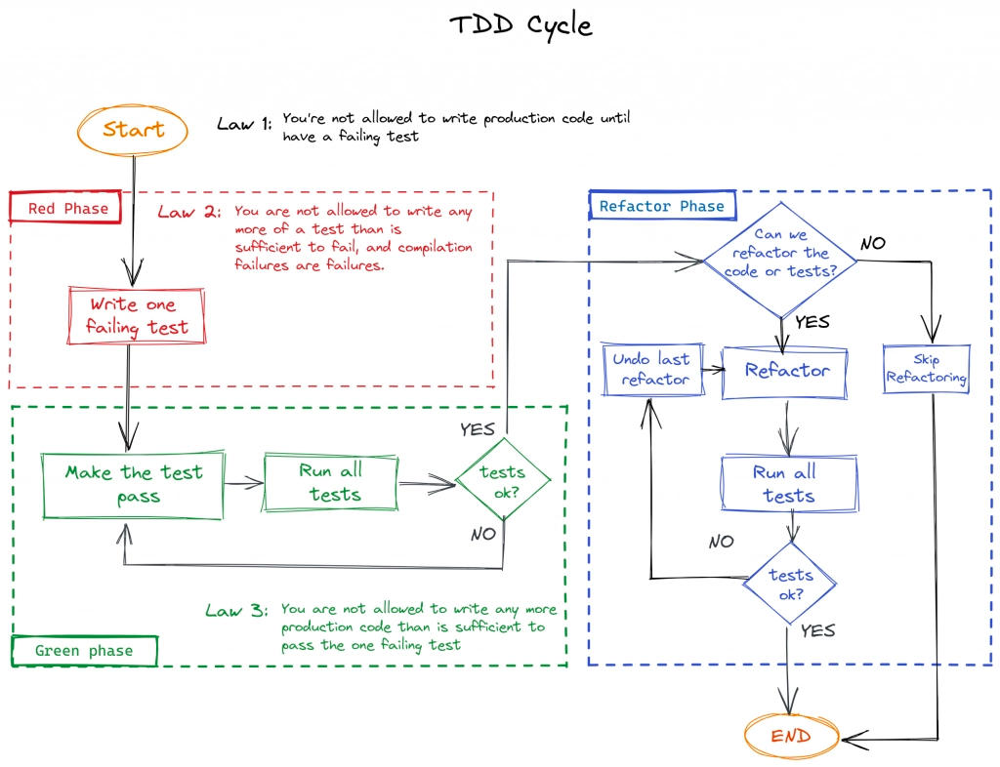
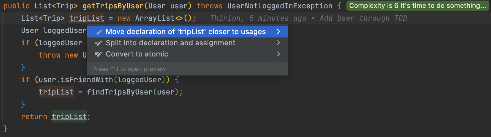
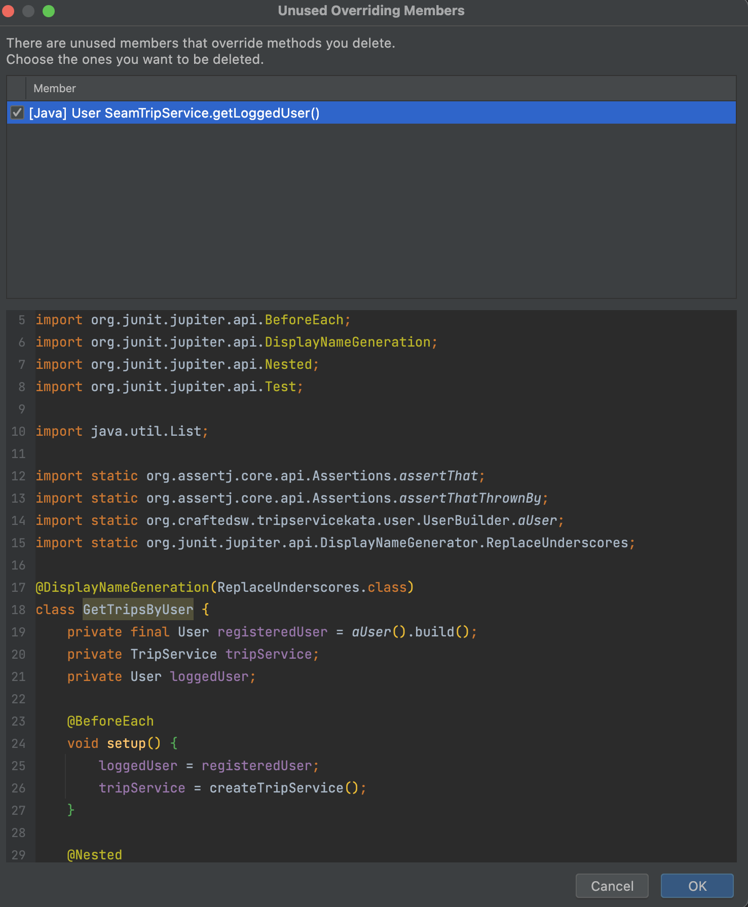

## Refactoring
> Start refactoring from deepest to shortest branch

### [Feature Envy](http://wiki.c2.com/?FeatureEnvySmell)
```java
for (User friend : user.getFriends()) {
    if (friend.equals(loggedUser)) {
        isFriend = true;
        break;
    }
}
```

- A common code smell
- When a class gets data from another class in order to do some calculation or comparison on that data
  - it means that the client class envies the other class
  - In OO, data and the operations on that data should be on the same object

> The whole point of objects is that they are a technique to package data with the processes used on that data. A classic smell is a method that seems more interested in a class other than the one it is in. The most common focus of the envy is the data.

- Let's fix it by using TDD (Test Driven Development)



- Implement a new behavior on `User` : `isFriendWith`

🔴 like in every good story, it starts with a red test

```java
@DisplayNameGeneration(ReplaceUnderscores.class)
class UserShould {
    private final User rick = aUser().build();
    private final User morty = aUser().build();

    @Test
    void return_false_when_2_users_are_not_friends() {
        var user = aUser()
                .friendsWith(rick)
                .build();

        assertThat(user.isFriendWith(morty))
                .isFalse();
    }
}
```

🟢 Implement the minimum to pass the test
```java
public class User {
    ...
    public boolean isFriendWith(User anotherUser) {
        return false;
    }
}
```

🔴 We add a second test (the passing/positive one)

```java
@Test
void return_true_when_2_users_are_friends() {
    var user = aUser()
            .friendsWith(rick, morty)
            .build();

    assertThat(user.isFriendWith(morty))
            .isTrue();
}

class User {
    ...
    public boolean isFriendWith(User anotherUser) {
      return friends.contains(anotherUser);
    }
}
```

🔵 We can now focus on our TripService

> Run your tests at any change in your production code

- Use the new `User` method

```java
public List<Trip> getTripsByUser(User user) throws UserNotLoggedInException {
    List<Trip> tripList = new ArrayList<>();
    User loggedUser = getLoggedUser();

    if (loggedUser != null) {
        var isFriend = user.isFriendWith(loggedUser);
        if (isFriend) {
            tripList = findTripsByUser(user);
        }
        return tripList;
    } else {
        throw new UserNotLoggedInException();
    }
}
```

- Simplify the code (inlining) :
```java
public List<Trip> getTripsByUser(User user) throws UserNotLoggedInException {
    List<Trip> tripList = new ArrayList<>();
    User loggedUser = getLoggedUser();

    if (loggedUser != null) {
        if (user.isFriendWith(loggedUser)) {
            tripList = findTripsByUser(user);
        }
        return tripList;
    } else {
        throw new UserNotLoggedInException();
    }
}
```

### Guard clause
- Move the guard clause to reduce complexity
  - Use the power of `IntelliJ`



```java
public List<Trip> getTripsByUser(User user) throws UserNotLoggedInException {
    User loggedUser = getLoggedUser();
    if (loggedUser == null) {
        throw new UserNotLoggedInException();
    }
    
    List<Trip> tripList = new ArrayList<>();
    if (user.isFriendWith(loggedUser)) {
        tripList = findTripsByUser(user);
    }
    return tripList;
}
```

### Simplify the code
- We want to remove the `tripList` now
```java
public List<Trip> getTripsByUser(User user) throws UserNotLoggedInException {
    User loggedUser = getLoggedUser();
    if (loggedUser == null) {
        throw new UserNotLoggedInException();
    }

    return user.isFriendWith(loggedUser)
            ? findTripsByUser(user)
            : new ArrayList<>();
}
```
- Use a business term for `ArrayList<>()`
```java
private static final List<Trip> NO_TRIPS = new ArrayList<>(); 

public List<Trip> getTripsByUser(User user) throws UserNotLoggedInException {
    User loggedUser = getLoggedUser();
    if (loggedUser == null) {
        throw new UserNotLoggedInException();
    }

    return user.isFriendWith(loggedUser)
            ? findTripsByUser(user)
            : NO_TRIPS;
}
```

- We can extract a method for the guard as well
```java
public List<Trip> getTripsByUser(User user) throws UserNotLoggedInException {
    User loggedUser = getLoggedUser();
    checkUser(loggedUser);

    return user.isFriendWith(loggedUser)
            ? findTripsByUser(user)
            : NO_TRIPS;
}

private void checkUser(User loggedUser) {
    if (loggedUser == null) {
        throw new UserNotLoggedInException();
    }
}
```

### Let's kill the Seam
- We can now attack our dependency issues

#### LoggedInUser
- Break the internal dependency by injecting the `loggedInUser` in our method
- Let's use our IDE for that -> `Change signature...` `⌘ + F6`

- Fix the tests by passing the `loggedInUser`
- Use the `loggedInUser` passed in method argument
```java
public List<Trip> getTripsByUser(User user, User loggedUser) throws UserNotLoggedInException {
    checkUser(loggedUser);

    return user.isFriendWith(loggedUser)
            ? findTripsByUser(user)
            : NO_TRIPS;
}
```
- We can now remove the `getLoggedUser` method
  - Both in our production and test codes



- Make some clean up in our tests
    - No need to set a loggedUser anymore
```java
@DisplayNameGeneration(ReplaceUnderscores.class)
class GetTripsByUser {
    private final User registeredUser = aUser().build();
    private TripService tripService;

    @BeforeEach
    void setup() {
        tripService = createTripService();
    }

    @Nested
    class return_An_Error {
        private final User guest = null;

        @Test
        void when_user_is_not_loggedIn() {
            assertThatThrownBy(() -> tripService.getTripsByUser(registeredUser, guest))
                    .isInstanceOf(UserNotLoggedInException.class);
        }
    }

    @Nested
    class return_ {
        private final Trip lisbon = new Trip();
        private final Trip springfield = new Trip();
        private final User anotherUser = aUser().build();

        @Test
        void no_trips_when_logged_user_is_not_a_friend_of_the_target_user() {
            var aUserWithTrips = aUser()
                    .friendsWith(anotherUser)
                    .travelledTo(lisbon)
                    .build();

            assertThat(tripService.getTripsByUser(aUserWithTrips, registeredUser))
                    .isEmpty();
        }

        @Test
        void all_the_target_user_trips_when_logged_user_and_target_user_are_friends() {
            var aUserWithTrips = aUser()
                    .friendsWith(anotherUser, registeredUser)
                    .travelledTo(lisbon, springfield)
                    .build();

            assertThat(tripService.getTripsByUser(aUserWithTrips, registeredUser))
                    .hasSize(2)
                    .contains(lisbon, springfield);
        }
    }

    private TripService createTripService() {
        return new SeamTripService();
    }

    private class SeamTripService extends TripService {
        @Override
        protected List<Trip> findTripsByUser(User user) {
            return user.trips();
        }
    }
}
```

#### TripDAO
- We want to be able to mock the behavior of our `Data Access` layer :
    - We need an instance method to do so with `Mockito`
- First, let's write a test on the implemented behavior
```java
@DisplayNameGeneration(ReplaceUnderscores.class)
public class TripDAOShould {
    @Test
    void retrieve_user_trips_throw_an_exception() {
        assertThatThrownBy(() -> TripDAO.findTripsByUser(UserBuilder.aUser().build()))
                .isInstanceOf(CollaboratorCallException.class);
    }
}
```
- Now let's change our test and create our code from it
```java
@DisplayNameGeneration(ReplaceUnderscores.class)
public class TripRepositoryShould {
    private final TripRepository tripRepository = new TripRepository();

    @Test
    void retrieve_user_trips_throw_an_exception() {
        assertThatThrownBy(() -> tripRepository.findTripsByUser(UserBuilder.aUser().build()))
                .isInstanceOf(CollaboratorCallException.class);
    }
}
```
- Implement the `TripRepository`
```java
public class TripRepository {
    public List<Trip> findTripsByUser(User user) {
        return TripDAO.findTripsByUser(user);
    }
}
```

- We can now work from our `TripServiceShould` to inject this dependency
  - Use the `Change Signature` refactoring tool for that
  - Clean the tests
    - Remove the `createTripService` method
```java
@ExtendWith(MockitoExtension.class)
class GetTripsByUser {
    ...

    @Mock
    private TripRepository repositoryMock;

    @BeforeEach
    void setup() {
        tripService = new TripService(repositoryMock);
    }
    ...
}
```
- Use the new dependency in our Service
```java
public class TripService {
    private static final List<Trip> NO_TRIPS = new ArrayList<>();
    private final TripRepository repository;

    public TripService(TripRepository repository) {
        this.repository = repository;
    }

    ...

    protected List<Trip> findTripsByUser(User user) {
        return repository.findTripsByUser(user);
    }
}
```
- Run the tests
  - We now receive an error because we have not configured the `TripRepository` mock


- Setup our mock
```java
@Test
void all_the_target_user_trips_when_logged_user_and_target_user_are_friends() {
    var aUserWithTrips = aUser()
            .friendsWith(anotherUser, registeredUser)
            .travelledTo(lisbon, springfield)
            .build();

    when(repositoryMock.findTripsByUser(aUserWithTrips))
            .thenReturn(aUserWithTrips.trips());

    assertThat(tripService.getTripsByUser(aUserWithTrips, registeredUser))
            .hasSize(2)
            .contains(lisbon, springfield);
}
```

That's it, we have removed our `seams` and refactored the legacy code.